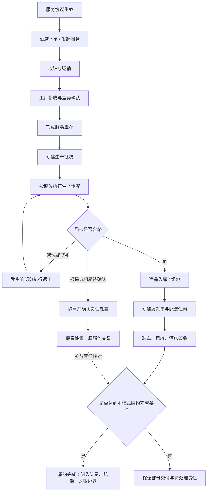
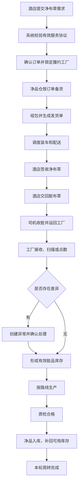
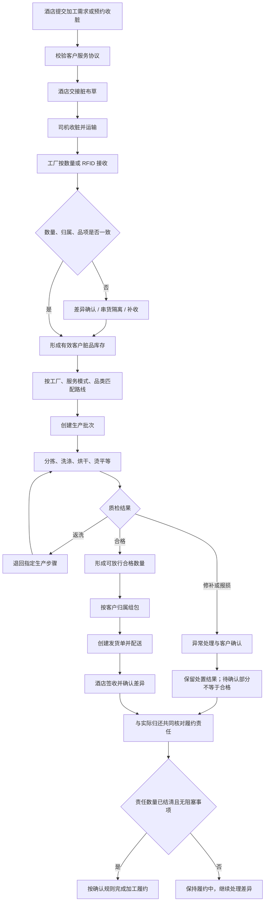
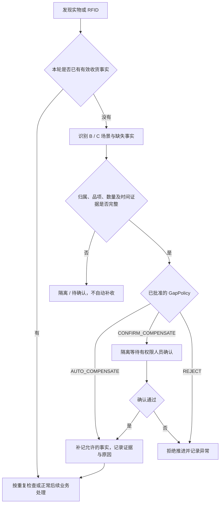
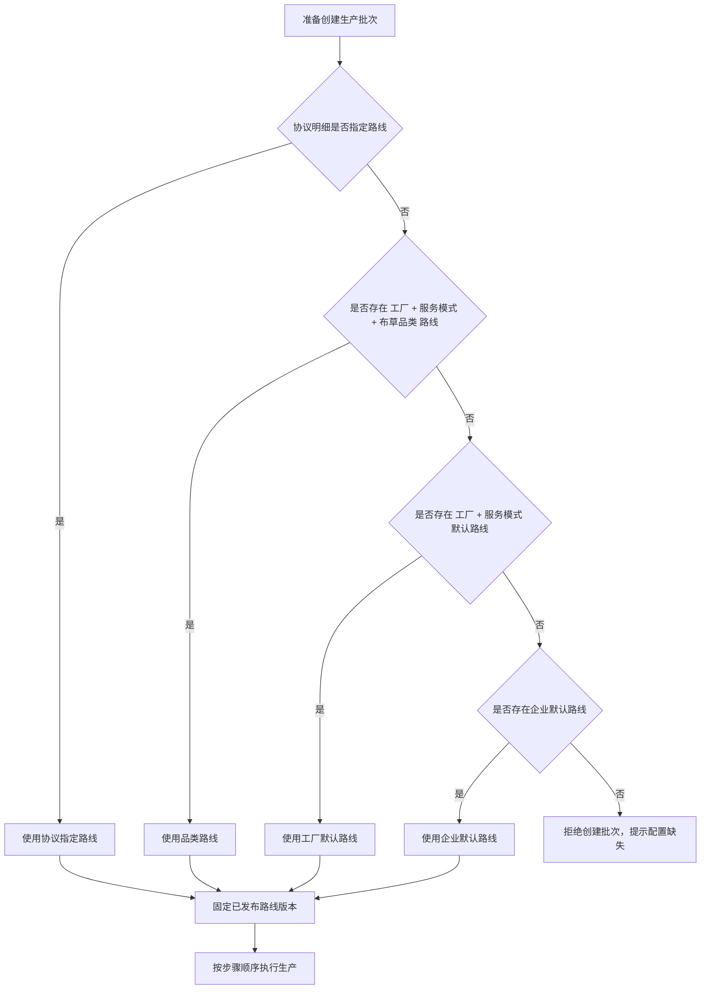
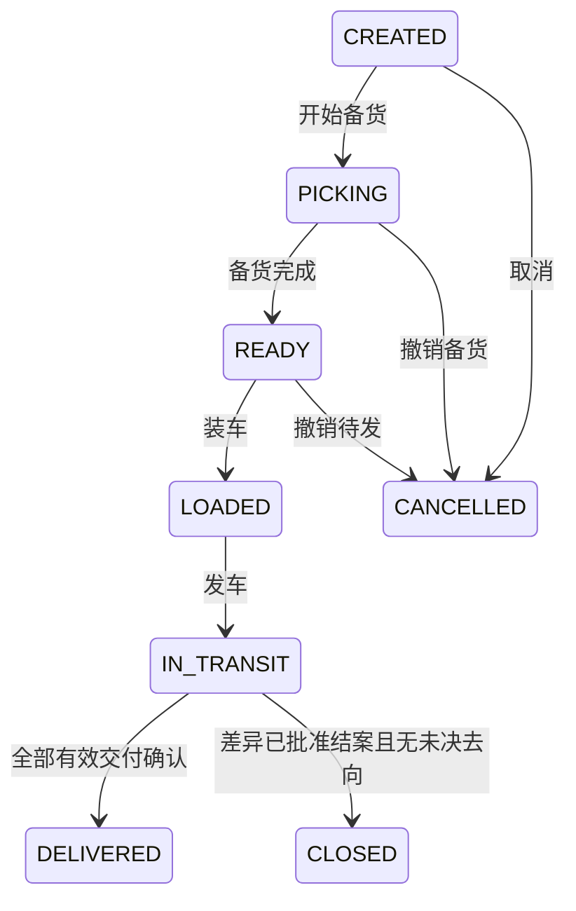
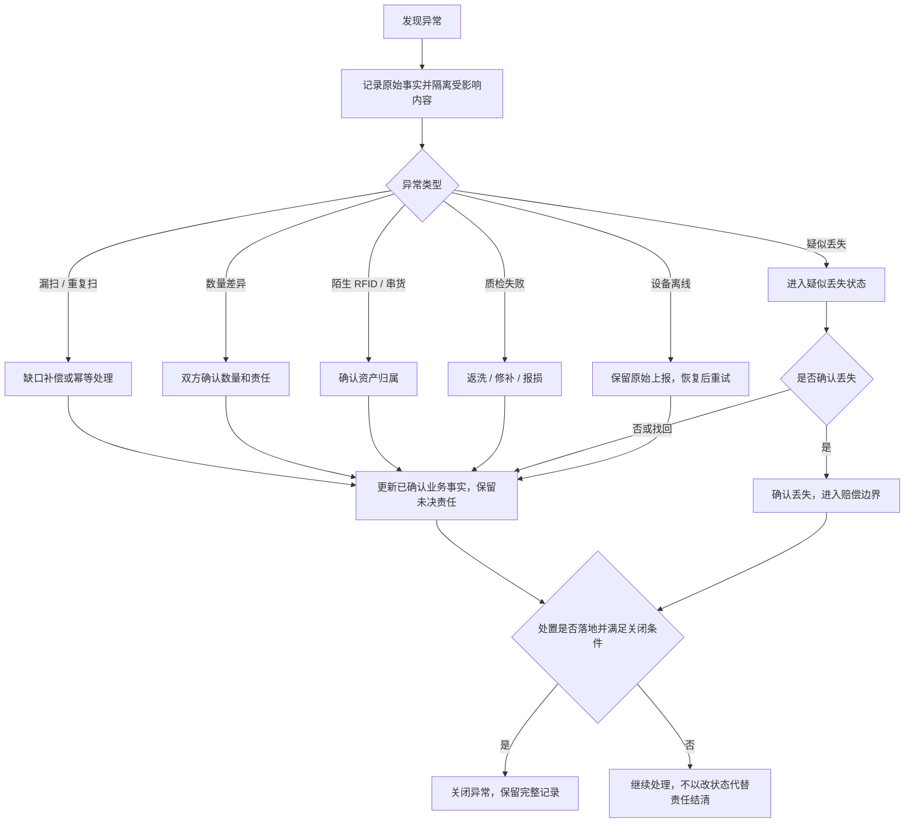

# yixi-saas 洗涤业务流程与产品需求说明 V1.1

> **版本：** V1.1（完整修订评审稿）  
> **修订日期：** 2026-09-19  
> **文档性质：** 产品业务流程、功能需求与评审基线；不代表全部需求已批准或功能已上线  
> **适用对象：** 产品经理、业务负责人、研发、测试、实施  
> **适用业务：** 租洗、普洗 / 客户自有布草洗涤  
> **关联文档：** [《yixi-saas 洗涤业务领域模型 V1.2》](历史领域模型（一点二版）.md)  
> **代码参照：** `canasher/yixi-saas@6c1a8072a48d7c63056d6852b4c1ee26e3193ecb`（上一轮已核对的固定快照，不表示本次重新核验了最新 main）  
> **文档目标：** 统一流程、单据、状态、异常、V1 范围及尚待确认的产品决策

**阅读约定：**“仓库既定约束”来自已核对代码 / ADR；“目标要求”描述待实现能力；“建议 / 待确认”须按第 19 章 PD 编号评审。新增字段和用例不是当前系统已实现的证明。未批准的建议不得由研发或 AI 工具自行升级为正式业务规则。

---

## 1. 产品经理先看这里

本产品不是为每一家洗涤厂分别开发一套流程，而是建立：

```text
稳定的外层履约流程
+
可配置的厂内生产路线
+
统一的异常补偿机制
```

外层稳定流程：

```text
签约
→ 下单 / 发起服务
→ 收脏
→ 工厂接收
→ 生产
→ 质检
→ 净品入库 / 组包
→ 发货
→ 配送签收
→ 对账结算
```

不同工厂主要变化的是：

```text
生产步骤
步骤顺序
某步骤是否必经
工艺参数
返洗回到哪个步骤
漏扫如何处理
使用人工、RFID 还是设备上报
```

产品设计必须优先通过“路线配置 + 业务参数”解决差异，禁止为某客户复制一套菜单、状态或后端流程。

### 1.1 本次产品评审需要确认

- [ ] 租洗与普洗的业务边界是否认可；
- [ ] 数量追踪与 RFID 单件追踪是否都需要；
- [ ] 订单、收货、生产、发货是否允许拆分和合并；
- [ ] A / B / C 收货场景的责任与计费规则；
- [ ] 生产路线允许配置到什么程度；
- [ ] 返洗、损坏、丢失和串货如何处理；
- [ ] 收脏与送净是否允许在同一次配送任务完成；
- [ ] V1 功能范围及明确不做项；
- [ ] 产品待确认问题的负责人和确认时间。

### 1.2 本版修订摘要

| 修订主题 | 本版处理 |
|---|---|
| 工厂与组织 | V1 仅使用 INITIAL；复用现有账号、员工、部门、角色及数据权限 |
| 库存与协议 | 区分实物、库存池和本次履约规则；共享与续签规则列入 PD-012/015 |
| 部分返洗 | 明确受影响数量 / 资产集合，方案选择列入 PD-011 |
| 签收与完成 | 分开实发、实收和差异处置；普洗未确认责任不默认为结清 |
| 初始化与幂等 | 补期初库存、RFID 建档、业务重复和并发验收 |
| 首版范围 | 分为通用 P0、条件 P0、后续增强；不把 Shipment 当可选能力 |

### 1.3 修订来源与适用限制

本版保留原 V1.0 的章节、业务术语和线性路线边界，依据上一轮《双文档评审与修改清单》修订。仓库事实按上述固定提交引用；本次为文档修订，没有运行构建、集成测试或生产验收。

仓库准入约束参见固定提交中的 [AGENTS.md](https://github.com/canasher/yixi-saas/blob/6c1a8072a48d7c63056d6852b4c1ee26e3193ecb/AGENTS.md)、[ADR-0007](https://github.com/canasher/yixi-saas/blob/6c1a8072a48d7c63056d6852b4c1ee26e3193ecb/docs/decisions/0007-v1-single-factory-organization-access.md) 和 [FactoryProductPolicy](https://github.com/canasher/yixi-saas/blob/6c1a8072a48d7c63056d6852b4c1ee26e3193ecb/modules/system/src/main/java/com/yixi/module/system/factory/service/FactoryProductPolicy.java)。更详细的代码映射、迁移版本和来源索引见领域模型第 1、19、20 章。

---

## 2. 产品定位与范围

yixi-saas 面向洗涤企业。一家企业拥有一个独立业务库。**V1 每家企业仅使用服务端解析的唯一启用 `INITIAL` 工厂，该工厂可服务多个酒店或客户。**

底层保留 Factory、业务表 `factory_id` 和 EmployeeFactory，为未来多工厂扩展保留结构；V1 不开放第二工厂创建、跨厂查询、工厂切换和客户侧员工工厂授权。不能用隐藏页面代替后端限制，也不能通过删除工厂模型锁死未来扩展。

产品需要支持两类核心业务：

| 业务模式 | 业务说明 | 管理重点 |
|---|---|---|
| 租洗 | 洗涤厂、租赁运营方或第三方向酒店提供布草 | 资产、周转、酒店持有量、洗涤次数、丢失、赔偿、租赁结算 |
| 普洗 | 酒店将自有布草交给洗涤厂加工后归还 | 客户归属、收发数量、串货、短缺、损坏、加工工艺和加工费 |

V1 先实现完整业务闭环，不建设万能配置平台。跨酒店共享租洗库存、酒店自助入口和首批 RFID 范围不能从“支持两种业务”推导为已批准，分别按 PD-012、PD-018、PD-016 确认。

### 2.1 当前系统实现现状

下表仅描述上一轮固定提交的静态核对结论；目标产品不等于已上线产品。

| 当前能力 | 现状 / 尚缺内容 |
|---|---|
| V1 单工厂与 IAM | 已存在 INITIAL 集中校验、员工工厂准入和角色 / 数据权限模型；洗涤业务应复用 |
| 订单创建 | 已有基础主单和明细示例，不等于完整履约规则 |
| 扫码入库 | 现有 DTO 和 Facade 均要求 RFID 非空；不能直接当作无 RFID 数量收货入口；缺稳定请求幂等和完整差异处理 |
| 库存 | 已有“仓库 + 布草品项”数量汇总；尚缺客户归属、脏净、质量及统一库位；读后写回数量存在需验证的并发风险 |
| 分拣上报 | 已有原始上报和分拣记录示例；无设备侧稳定消息号的入口不足以覆盖设备重发，不等于生产路线闭环 |
| 服务协议、库存池、生产路线和批次 | 完整洗涤规则尚未实现 |
| RFID 资产、期初库存、载具、发货单和异常中心 | 本文件描述的完整能力尚未实现 |
| 计费、账单、赔偿和支付 | 保留业务边界，完整闭环需独立 PRD |

“源码存在”“已有测试记录”“共享环境可用”“生产验收完成”须分别记录。本次不据历史状态文档中的阶段标签宣称上线，也没有以并发测试证明上述风险已经发生。

### 2.2 当前工厂资料维护边界

产品的“工厂资料”仅指 INITIAL 的受控资料查看 / 维护，不包含普通企业用户创建第二工厂、任意停用 INITIAL、修改工厂准入规则。具体资料维护入口和字段仍需实现；系统开通与受信任维护不等于开放工厂管理产品。

---

## 3. 参与角色

| 角色 | 主要职责 |
|---|---|
| 酒店下单人 | 提交需求、确认服务品项和数量 |
| 酒店交接人 | 交付脏布草、确认交接差异、签收净布草 |
| 司机 / 配送员 | 收脏、装卸、运输、送达、取得签收 |
| 工厂收货员 | 工厂接收、点数或扫描、登记差异 |
| 分拣 / 生产操作员 | 分拣、洗涤、烘干、烫平、折叠等生产操作 |
| 质检员 | 合格、返洗、修补、报损和异常判定 |
| 净品仓管员 | 净品入库、备货、组包、装车 |
| 调度员 | 创建配送任务、分配司机和车辆 |
| 工厂管理员 | 配置品项、库位、服务协议和生产路线 |
| 财务人员 | 计费、赔偿、账单、对账；V1 只保留业务边界 |
| 实施 / 运维 | 在授权范围内协助配置和排查，不替代业务人员确认事实 |

### 3.1 角色与系统身份的关系

表内角色表达业务职责，不要求新建一套账号、员工或角色表。企业内部人员复用 Employee，登录账号复用 Account；员工所属部门不代替工厂准入。

业务操作记录须区分企业员工、设备、系统任务和酒店外部人员。内部司机如是企业员工，复用 Employee；外包司机与酒店交接人的账号绑定、授权及签收凭证按 PD-018/021 确认，不能默认赋予企业员工权限。

### 3.2 历史责任不能随组织变更改写

调岗、离职或角色调整不修改旧单据的实际操作人和交接人。当前访问权限依现有 IAM 重新判定；历史记录保留稳定身份引用和必要的展示快照。

---

## 4. 核心产品术语

| 产品名称 | 业务含义 | 特别说明 |
|---|---|---|
| 布草品项 | 一类布草的名称、规格和计量单位 | 例如“客房床单 240×280”，不是某一件床单 |
| 单件资产 | 有独立 RFID 或资产码的一件布草 | 只用于单件追踪模式 |
| 服务协议 | 某酒店与当前工厂的合作规则 | 决定本次履约模式、追踪兼容性、所有权要求、路线及计价引用；历史单据保留版本或规则快照 |
| 库存池 / 资产池 | 同一套归属和追踪规则下的实物集合 | 客户专属或共享须确认；不是一张订单，也不能简单等同于某次协议版本 |
| 服务订单 | 客户本次提出的需求 | 不等于收货单、生产批次或发货单 |
| 收货单 | 工厂接收脏布草的业务凭证 | 包含正常、补收和差异场景 |
| 生产路线 | 厂内生产步骤模板 | 只管理厂内加工，不管理司机配送 |
| 路线版本 | 某次发布后的不可变路线 | 已开始生产的批次继续使用旧版本 |
| 生产批次 | 本次实际进入生产的一批布草 | 拆批保存来源分配；合批开放范围待确认；部分返洗必须定位受影响明细 / 资产 |
| 载具 | 扎码、包、筐、袋、笼车、吊袋等 | 用于批量操作和物流交接 |
| 发货单 | 本次从工厂发往酒店的货物清单 | 记录备货、装车、在途和送达 |
| 配送任务 | 司机和车辆的执行任务 | 一个任务可承载多个发货单 |
| 库位 | 布草当前所在的位置 | 酒店、车辆、脏区、生产区、净物仓等 |
| 异常记录 | 漏扫、数量差异、串货、损坏、返洗和丢失事实 | 必须可处理、可追溯，不允许静默改库存 |

“发货”“签收”“履约完成”“异常关闭”和“财务结清”是不同事实，不用一个“已完成”代替所有判断。

---

## 5. 两种追踪方式

同一个库存池只能有一种权威追踪方式。协议明细声明其适用追踪方式，并与实际库存池保持一致；不能因为换一份协议就把同一批布草重复建成两套库存。

| 追踪方式 | 适用场景 | 权威记录 |
|---|---|---|
| 按数量追踪 `QUANTITY` | 无 RFID 的普洗、数量管理的租洗 | 按归属、品项、库位、脏净和质量记录数量余额及流水，不虚构单件资产 |
| RFID 单件追踪 `RFID_PIECE` | 租洗资产或需要单件生命周期追踪的普洗 | 每件资产的位置、状态、洗涤次数和历史；汇总是单件事实的投影 |

同一品项可在不同、明确隔离的库存池采用不同模式，但同一实物不能重复归属两个权威池。池划分、共享及续签兼容规则按 PD-012 确认。

### 5.1 重量口径（PD-002，待确认）

**本版建议件数 / 条数为权威数量，重量只作交接、工艺或计价辅助数据。** 在 PD-002 批准前，不承诺按重量管理权威库存；若要支持重量库存，须同步确认数量精度、单位换算、计价和差异规则，不能直接复用整数件数设计。

### 5.2 RFID 单件操作边界

单件操作数量由去重后的有效资产集合推导；一个 RFID 对应一件有效资产时，不能提交任意 `quantity=10` 增加十件库存。数量收货和 RFID 收货分别校验，不能要求数量模式伪造 RFID。

追踪方式切换必须受控迁移和对账，不能直接修改协议字段或品项 `rfid_enabled`，让已有库存自动变成另一套权威事实。

---

## 6. 总体业务流程



### 6.1 固定与可配置的边界

| 环节 | 产品处理方式 |
|---|---|
| 服务协议、订单、收货、库存、生产批次、发货、签收 | 稳定产品能力 |
| 厂内步骤顺序、可选步骤、工艺参数 | 生产路线配置 |
| 漏扫处理 | 缺口策略配置 |
| 新设备协议 | 设备适配能力 |
| 新库存行为、新责任规则、新交易行为 | 新产品能力，需要正式需求评审 |

该图表达完整业务能力，不要求每张租洗净品订单先收脏。租洗可从已初始化或已生产完成的净品库存开始；第 7 章的送净与后续回收是关联周转，不是同一订单必经的同步步骤。

---

## 7. 租洗标准流程

租洗以“酒店获得可用净布草，脏布草回厂并重新生产”为一个周转循环。



### 7.1 租洗业务规则

1. 酒店订单不能直接改变真实库存。
2. 备货确认产生数量预留或单件锁定，不提前移动实物；装车和实际签收才分别形成对应位置移动。
3. 酒店签收代表净布草完成交付，不代表脏布草已经回厂。
4. 酒店交回量、司机收脏量和工厂接收量允许存在差异，但差异必须被记录和确认。
5. RFID 模式下，酒店持有量以单件资产位置为明细真相。
6. 丢失确认与赔偿是两个动作：先确认资产丢失，再按协议生成赔偿。
7. 找回已确认丢失的资产时必须保留找回记录；已结赔偿如何冲销由结算规则决定。
8. 净品生产完成后回到符合本池归属规则的可用库存；不得擅自归入跨酒店公共池。共享边界按 PD-012 确认。

### 7.2 租洗订单完成口径

V1 建议：

```text
本单应交付净品已全部实际签收
+
与订单直接关联的发货不存在未决交付事项
=
订单履约完成
```

脏布草回收属于周转后续事实，不阻塞净品订单完成。若客户合同要求“送净 + 收脏”同时闭环，可由服务协议或订单类型另行约定，不修改通用订单状态。

### 7.3 库存池与协议续签（PD-012/015，待确认）

普通租洗库存不能仅靠“当前酒店”或“当前协议”决定永久资产身份。需分别记录实物所有者、客户专属 / 共享规则、本次订单适用协议。

本版建议：客户自有布草严格专属；租洗是否共享由首客确认，未确认前不开放跨酒店取用。续签复用兼容库存，不新建同一件资产、不重置洗涤次数；历史单据继续使用确认时的协议版本或关键规则快照。所有权、追踪方式或专属范围发生变化时，不按普通续签自动迁移。

### 7.4 第一张租洗订单的库存来源

第一张订单备货前必须已有可追溯净品库存。最小入口为经授权确认的期初录入 / 导入，或真实收货生产形成的净品库存；不能直接改库存余额凑出可发货量。

数量模式记录品项、归属、库位、脏净、质量和数量，并生成期初流水。RFID 模式同时完成资产建档、有效标签唯一绑定和初始事件。期初确认角色、时点及重复数据处置按 PD-019 确认；本能力不扩成完整采购系统。

---

## 8. 普洗标准流程

普洗的重点不是洗涤厂自有库存，而是“客户交来多少、实际生产多少、最终归还多少”。



### 8.1 普洗业务规则

1. 客户自有布草必须保留客户归属，不能只按品项合并成工厂公共库存。
2. 数量模式不虚构单件资产；系统按客户、品项、库位、脏净和质量状态管理数量。
3. RFID 模式必须识别陌生标签、错误客户和重复扫描。
4. 多个酒店的布草是否允许合批由 PD-004 确认；建议默认不开放。允许的拆批 / 合批都必须保存明细来源和数量 / 资产分配。
5. 入厂数量、投入生产数量、合格数量、返洗数量、报损数量和最终发货数量必须可对账。
6. 质检失败不直接删除数量，应进入返洗、修补、报损或待确认状态。
7. 发货组包必须按客户归属和服务协议隔离，防止串货。
8. 酒店签收差异必须形成独立异常，不允许直接覆盖工厂发货数量。

### 8.2 普洗订单完成口径（PD-014，待确认）

建议按订单明细核对“本单需承担的处理责任”，并保留原订单量、申报量、实收量及经批准的调整，不能为了结单覆盖历史数量。

```text
本单确认的应处理责任量
= 已确认归还量 + 已批准的其他结案处置量
且不存在阻塞性的返洗、短缺、待确认报损或未解决交付差异
→ 才可完成本单履约
```

“其他结案处置”必须具有批准记录和明确数量，是否要求酒店确认、哪些异常阻塞结单由 PD-014 确认；不能把“已提报损”当作已批准。财务支付、开票与业务履约完成分开。

例如收 100、归还 98、2 件报损待确认时，只能显示部分归还，不能默认为整单完成。批准处置后按规则结单，原实收 100 和实还 98 保持不变。

### 8.3 部分合格与返洗

合格部分可按已批准放行规则独立入净品库存和发货；未合格部分保留责任和追踪。返洗不能使已合格部分重新计产或退回，也不能通过拆子批次让原订单丢失未处理责任。具体执行粒度按第 10.5 章和 PD-011 确认。

---

## 9. 收货 A / B / C 场景

产品可继续使用 A / B / C 作为页面名称或编号，底层统一收货流程，不复制三套业务代码。

| 页面场景 | 业务含义 | 底层场景 |
|---|---|---|
| A 单 | 正常收货 | `NORMAL` |
| B 单 | 工厂发现酒店或前置节点漏扫 | `FACTORY_COMPENSATION` |
| C 单 | 生产环节发现酒店和工厂均漏扫 | `PRODUCTION_COMPENSATION` |



### 9.1 统一策略表（PD-017，待确认）

| 策略 | B / C 共同语义 | 适用限制 |
|---|---|---|
| `AUTO_COMPENSATE` | 证据齐全时补记允许的交接 / 收货事实并记录补偿 | 必须先批准适用场景；未知客户、未知品项或无法确认数量不自动处理 |
| `CONFIRM_COMPENSATE` | 受影响内容隔离，授权人员确认后补记 | 本版推荐 C 场景使用此默认策略，尚待产品确认 |
| `REJECT` | 拒绝当前业务推进并记录异常 | 不能静默吞掉原始上报 |

B / C 是否影响收费、责任和绩效按 PD-005 另行确认。自动策略并非 V1 的强制默认，未批准自动适用规则前不开放自动推进。UAT-05 与本表一致，不再一律把 C 场景写成人工确认。

### 9.2 证据和补偿边界

1. 自动或人工补偿都保留原始证据、缺失类型、发现节点、实际发生时间、处理时间、操作者 / 系统来源及关联单据。
2. 补偿只修复可以证实的缺失记录，不隐藏串货、短缺和损坏。
3. 下游扫描不是洗涤、消毒或质检完工证据，不允许凭扫描补出“已经 WASH / STERILIZE / QC 合格”。
4. 已有可信设备完工证据可幂等重放真实步骤，与虚构前置完工不同。
5. 补录历史事实不自动把当前库位退回历史位置；时序冲突进入复核，不以“最后收到的消息”覆盖当前真相。
6. RFID 的重复判断限定本轮有效收货 / 周转事实；不能永久禁止某标签再次回厂。

---

## 10. 生产路线配置与执行

### 10.1 路线匹配顺序



### 10.2 路线示例

床单：

```text
分拣
→ 洗涤
→ 烘干
→ 烫平
→ 折叠
→ 质检
→ 净品入库
```

毛巾：

```text
分拣
→ 洗涤
→ 烘干
→ 折叠
→ 质检
→ 净品入库
```

特殊客户：

```text
称重
→ 分拣
→ 去渍
→ 洗涤
→ 消毒
→ 烫平
→ 双重质检
→ 组包
```

### 10.3 V1 允许配置

| 配置项 | 产品含义 |
|---|---|
| 步骤顺序 | 先做什么、后做什么 |
| 是否必经 | 某品类是否可以跳过该步骤 |
| 是否允许重复 | 称重、质检等是否可重复执行 |
| 是否允许返工 | 质检失败是否可回到指定步骤 |
| 返工目标步骤 | 返洗回洗涤、修补回修补等 |
| 缺口策略 | 漏步骤时自动补偿、人工确认或拒绝 |
| 工艺参数 | 温度、时长、程序号等业务参数 |
| 处理方式 | 人工操作、终端扫描或设备上报 |

### 10.4 V1 不允许配置

- 任意并行流程；
- 任意条件脚本；
- 自定义 JavaScript、SQL 或表达式；
- 上传客户代码；
- 随意修改已发布路线版本；
- 把司机配送和酒店签收塞入生产路线。

### 10.5 部分返洗的执行范围（PD-011，待确认方案）

100 件完成首次质检、90 件合格、10 件返洗时，系统必须准确标识返洗的 10 件 / 数量明细。原批次 `current_step_id` 不能作为所有内容物的唯一进度。

| 方案 | 处理方式 | 需要保留 |
|---|---|---|
| A：关联返工子批次（V1 优先建议） | 把返洗部分分配到子批次，从原路线指定返工步骤开始 | 原批次、来源明细、数量 / 资产集合、原步骤、目标步骤、原因 |
| B：批次内执行分组 | 保留同一批次，按明细 / 分组分别记录进度和尝试 | 分组内容、步骤尝试及分组级当前进度 |

两种方案选一实施，不同时建设两套执行真相。返工沿用已固定路线版本；不得因拆子批次自动选择刚发布的新路线。真实返洗完成只对本次执行集合计洗，90 件合格部分不重复计次。

### 10.6 步骤结束不等于整单结束

批次步骤可以记录“输出已分类”，但返洗、修补或报损待确认仍是未处理责任。采用子批次时，父批次自身执行结束与父子责任链完成分开展示；订单完成按第 7.2 / 8.2 章判断。

---

## 11. 主要业务单据与关系

| 单据 / 记录 | 产生时机 | 核心内容 | 完成标志 |
|---|---|---|---|
| 服务协议 | 客户合作规则生效 | 模式、品项、追踪、所有权、路线和计价引用 | 协议有效 |
| 服务订单 | 酒店发起需求 | 酒店、品项、数量、服务模式 | 相关履约已完成 |
| 收货单 | 工厂接收脏布草 | 来源、场景、接收数量、差异 | 接收事实确认 |
| 库存流水 | 实物位置或数量变化 | 变更前后、来源、库位、数量 | 写入即完成 |
| 生产批次 | 布草投入生产 | 来源、路线版本、执行范围及数量 / 资产 | 本批次分配内容已形成明确结果；派生返工责任另行汇总 |
| 步骤记录 | 每一步生产执行 | 步骤、次数、输入输出、人员设备 | 本步骤成功或异常结束 |
| 异常记录 | 发现差异或异常 | 类型、期望、实际、责任和处理结果 | 已解决或关闭 |
| 载具记录 | 扎码或装入载具 | 类型、内容物、状态 | 关闭但保留历史 |
| 发货单 | 净品准备离厂 | 目的地、实发、实收、差异及载具 | 全量交付或按批准规则完成差异处置；未决部分不默认为已交付 |
| 配送任务 | 调度司机车辆 | 司机、车辆、时间和发货单 | 任务内单据已处理 |
| 账单 | 达到计费条件 | 加工费、租赁费、赔偿等 | 对账或支付完成 |

### 11.1 单据不是一一对应

```text
一个订单
→ 可以分多次收货、生产和发货

多个收货单
→ 可以合并到一个生产批次

一个生产批次
→ 可以拆成多个发货单

一个配送任务
→ 可以承载多个发货单
```

产品原型、接口和数据库均不得用“一张订单只能有一张收货单”等限制锁死未来业务。

### 11.2 V1 就要保留的分配事实

FR-105 已要求拆批履约，首版必须能回答：某次生产投入来自哪张收货明细、用了多少；某次发货履约哪张订单明细、抵扣多少；同一数量 / 资产是否已分配给其他执行。

每笔分配保留来源明细、目标明细、数量或资产集合、有效 / 撤销状态及关联操作。撤销不删除历史，重新分配不能重复抵扣。不能只保存主单号，也不能等业务出现后才补关系。

多个酒店合批仍按 PD-004 控制。图中的多对多表达模型容量，不代表首版开放任意混批；允许的拆批关系与未开放的合批入口要分开。

### 11.3 司机收脏与工厂接收

单独收脏任务也要有业务凭证关联，不能只建立配送任务与净品发货单关系。酒店申报、司机接收和工厂实收分别记录，不相互覆盖。

任务明细可按 `PICKUP / DELIVERY` 区分并关联各自凭证，具体复用交接 / 收货单的方式按 PD-021 确认。“送净 + 收脏同任务”按 PD-006 决定是否开放，目前仅为模型预留，不宣称已实现。

---

## 12. 状态设计

### 12.1 服务订单状态

| 状态 | 说明 | 允许动作 |
|---|---|---|
| 已创建 `CREATED` | 订单草稿或刚创建 | 编辑、确认、取消 |
| 已确认 `CONFIRMED` | 已进入履约准备 | 创建相关履约单据 |
| 履约中 `IN_FULFILLMENT` | 已有收货、生产或发货动作 | 查看进度、处理异常 |
| 已完成 `COMPLETED` | 达到订单完成口径 | 查看、对账 |
| 已取消 `CANCELLED` | 未继续履约 | 查看取消原因 |

### 12.2 收货单状态

| 状态 | 说明 |
|---|---|
| 已创建 | 已生成收货任务或单据 |
| 接收中 | 正在点数、称重或扫描 |
| 待差异确认 | 申报与实收、归属或标签存在差异 |
| 已完成 | 有效接收事实已确认 |
| 已取消 | 未发生有效收货 |

### 12.3 生产批次状态

| 状态 | 说明 |
|---|---|
| 已创建 | 已确定路线版本和投入内容 |
| 生产中 | 正在执行路线步骤 |
| 暂停 / 隔离 | 存在设备、归属、质量或数据异常 |
| 已完成 | 本批次执行范围已处置并满足已批准完成条件；待返洗不能直接算合格，子批次未决责任仍需展示 |
| 已取消 | 尚未产生不可逆生产事实时取消 |

### 12.4 发货单状态



已经装车后不允许直接取消，应走卸车、退回或异常处理。

### 12.5 部分签收与差异结案（PD-013/020，待确认）

上图 `CLOSED` 为本版新增的**建议业务状态，不是当前已实现枚举**：区分“全部已送达”和“含退回 / 短缺等处置后的物流结案”。是否采用该枚举，或采用独立结案字段，由 PD-013/020 批准；未批准前不得自行合并为 `DELIVERED`。

建议规则：部分签收时保留原单实发总量，按明细记录实收、拒收、短缺和待确认；尚有未决部分时原单不标全量交付。只有实际确认交付部分移动到酒店库位。

```text
装车 100，酒店确认收到 98
→ 98 件移动到酒店
→ 2 件按真实证据记录仍在车辆待退、已退回、隔离或位置待确认
→ 处置未定之前不将 2 件算入酒店实收，也不把原发货数量改成 98
```

差异量 = 原实发量 - 已确认实收量。拒收、短缺、待确认是该差异的互斥分配，同一件不能同时计入两类。多次签收以累计有效明细核算，纠错以冲正 / 更正记录保留历史。

物流差异结案不自动等于订单完成：原订单仍欠 2 件时，需要补送或批准调整履约责任。具体结案角色、证据和补送规则按 PD-013/014 确认。

### 12.6 库存动作表

| 业务动作 | 库存效果 | 不允许的处理 |
|---|---|---|
| 创建 / 确认订单 | 不直接改变实物数量和位置 | 按订单需求直接加减现存库存 |
| 确认备货 | 从可用量形成数量预留 / 资产锁定 | 提前把实物移动到酒店 |
| 撤销备货 | 释放对应预留 | 凭空增加实物数量 |
| 装车 | 对实装内容从待发区移到车辆，同时转换 / 释放原预留 | 只改发货状态不移库存，或重复扣减 |
| 酒店签收 | 只把实收内容移到酒店 | 整张单有签名就移动全部实发量 |
| 卸车 / 退回 / 更正 | 保存独立移动和原单关联 | 删除原流水或覆盖原实发 / 实收 |

可用量需在已允许发货的状态桶内核算“现存量减有效预留量”；隔离、脏品等若已分桶排除，不再重复扣减。具体预留粒度和装车转换按 PD-020 确认。

---

## 13. 异常处理流程



### 13.1 异常处理原则

1. 先记录原始事实，再修改当前状态。
2. 异常内容在未确认前进入隔离或待处理，不能混入正常库存。
3. 任何人工修改都必须填写原因。
4. 返洗、修补、报损和丢失是不同结果，不能统一成“异常完成”。
5. 赔偿是否发生由协议和结算规则决定，不自动等同于确认丢失。
6. 找回先恢复丢失维度并记录可信位置，不自动变为洁净、合格或可发货；质量 / 洁净未知时隔离待检，已报废生命周期不能因找回自动恢复。历史丢失与赔偿关联保留。

异常“关闭”要求对应处置已落地，不能只改异常状态掩盖库存或履约未决责任。自动补偿和历史重放均遵守第 9.2 章证据及时间顺序边界。

---

## 14. 功能需求清单

**范围标签：**通用 P0 为首版基础闭环；条件 P0 在首批客户选用该能力时必须交付并验收；P1 为后续增强。表内 RFID 专项标为“条件 P0”，不因章节名含 P0 就默认为所有客户必做。酒店自助下单 / 签收入口亦须按 PD-018 确认；管理端代录不等于已实现酒店身份隔离。

PD-016 负责确认首批追踪方式和最小设备适配，未确认前不能把条件 P0 全部删除或全部强制排入首发。

### 14.1 P0：服务协议与基础资料

| 编号 | 功能需求 | 产品验收 |
|---|---|---|
| FR-001 | 当前 INITIAL 资料、酒店和布草品项维护 | 工厂仅受控查看 / 维护，不开放第二工厂及准入变更；停用资料不用于新业务，历史保留 |
| FR-002 | 维护树形库位 | 支持酒店、车辆、脏区、生产区、净物仓和异常区 |
| FR-003 | 创建服务协议及明细 | 明确模式、追踪方式、所有权要求、库存池兼容范围、默认路线和有效期 |
| FR-004 | 校验协议有效性 | 无有效协议或品项不在协议内时禁止确认订单 |
| FR-005 | 控制追踪方式变更 | 已有有效库存时不得直接切换追踪方式 |
| FR-006 | 协议历史与在途履约 | 确认单据保存版本 / 规则快照；到期后的在途动作按 PD-015 校验 |
| FR-007 | 库存池归属与续签兼容 | 普洗不串客户；租洗共享及续签按 PD-012，不重建实物或改旧单 |
| FR-008 | 数量期初库存确认 | 录入 / 导入后生成期初流水；重复数据不重复增加 |
| FR-009 | RFID 建档与初始绑定（条件 P0） | 有效 EPC 绑定唯一，初始状态可审计，不以重建资产实现换标 |

### 14.2 P0：订单

| 编号 | 功能需求 | 产品验收 |
|---|---|---|
| FR-101 | 管理端创建订单；酒店入口为条件 P0 | 选择授权酒店、协议、品项和数量；酒店身份绑定按 PD-018 |
| FR-102 | 确认、取消和查看订单进度 | 状态变化符合状态表，不允许任意跳转 |
| FR-103 | V1 单订单单服务模式 | 租洗和普洗不能混在同一订单 |
| FR-104 | 展示履约关联 | 可查看相关收货、生产、发货和异常 |
| FR-105 | 支持拆批履约及明细分配 | 一张订单分次收发，数量 / 资产分配可追溯，不重复抵扣；合批按 PD-004 |
| FR-106 | 区分两种模式的完成条件 | 普洗待确认责任不默认为结清；租洗净品完成不强制等待下一轮收脏 |

### 14.3 P0：收货与交接

| 编号 | 功能需求 | 产品验收 |
|---|---|---|
| FR-201 | 正常收货，分别校验数量与 RFID | 无 RFID 入口不强制标签；件数主、重量辅为 PD-002 待确认建议；RFID 为条件 P0 |
| FR-202 | 支持 A / B / C 场景 | 页面可显示 A/B/C，底层统一保存收货场景 |
| FR-203 | 记录申报、实收和差异 | 数量差异不能被静默覆盖 |
| FR-204 | 陌生 RFID / 错误归属隔离（RFID 为条件 P0） | 未确认前不得进入正常库存；数量模式也校验客户归属 |
| FR-205 | 收货完成后增加脏品库存 | 单据、库存和流水结果一致 |
| FR-206 | 终端重复提交幂等 | 同键重试返回原结果；同键不同内容拒绝；不重复建单或加库存 |
| FR-207 | 司机收脏与工厂实收分离 | 保存酒店申报、司机实收、工厂实收及差异，不相互覆盖 |
| FR-208 | 同轮业务防重 | 即使换请求号，同轮有效事实不重复入账；真实新轮允许再次收货 |
| FR-209 | B / C 策略与证据控制 | 按批准策略补偿 / 待确认 / 拒绝，不凭下游扫描虚构生产完成 |

### 14.4 P0：库存与库位

| 编号 | 功能需求 | 产品验收 |
|---|---|---|
| FR-301 | 按库位查看库存 | 可按工厂、客户、品项、脏净和质量筛选 |
| FR-302 | 数量模式库存管理 | 以数量库存和流水为权威事实 |
| FR-303 | RFID 模式单件查询（条件 P0） | 可查看资产当前位置、状态和历史，汇总可与明细核对 |
| FR-304 | 支持移库、隔离和释放 | 每次变化产生流水或单件事件 |
| FR-305 | 防止负库存 | 并发出库、装车或调整不能产生非法数量 |
| FR-306 | 实时状态查询 | 订单、库存、库位和 RFID 实时查询读取 WRITE，不展示延迟副本事实 |
| FR-307 | 备货预留与释放 | 预留、装车和撤销按同一口径处理，不重复扣减或凭空增量 |
| FR-308 | 库存并发正确性 | 不同有效请求累计正确；同一最后库存不被重复占用 |

### 14.5 P0：路线与生产

| 编号 | 功能需求 | 产品验收 |
|---|---|---|
| FR-401 | 创建生产路线草稿 | 配置步骤、顺序、必经、重复、返工和缺口策略 |
| FR-402 | 发布路线版本 | 已发布版本不可原地修改，只能发布新版本 |
| FR-403 | 自动匹配路线 | 按协议、工厂、服务模式、品类和默认级别匹配 |
| FR-404 | 创建生产批次 | 固定路线版本，记录数量或资产 |
| FR-405 | 执行生产步骤 | 记录人员、设备、时间、输入和输出 |
| FR-406 | 质检结果处理 | 支持合格、返洗、修补、报损和待确认 |
| FR-407 | RFID 洗涤计次（条件 P0） | 只对真实完成本次 WASH 的资产集合计次，不给整批统一重计 |
| FR-408 | 步骤重复幂等 | 同请求和同业务步骤尝试不重复记账 / 计洗 |
| FR-409 | 部分返洗与部分放行 | 100 件中 90 合格、10 返洗能独立处理，来源不丢失；方案按 PD-011 |
| FR-410 | 真实生产证据 | 洗涤、消毒、质检不由普通缺口补偿伪造，历史补录不倒退当前位置 |

### 14.6 P0：载具、发货与配送

| 编号 | 功能需求 | 产品验收 |
|---|---|---|
| FR-501 | 人工创建扎码、包、筐等载具 | 数量明细为通用闭环；RFID 内容物绑定为条件 P0；不含自动搬运或嵌套 |
| FR-502 | 载具整体操作 | 移库、备货和装车可批量作用于内容物 |
| FR-503 | 创建发货单 | 明确酒店、来源、品项、数量和载具 |
| FR-504 | 发货状态流转 | 备货、待发、装车、在途和送达顺序正确 |
| FR-505 | 创建配送任务 | 可分配司机、车辆和一个或多个发货单 |
| FR-506 | 实际签收与差异结果 | 保存实发、实收和未决明细；差异按批准规则处理，不误标全量交付 |
| FR-507 | 库存同步移动 | 实装进入车辆，实收进入酒店；未收部分保留可信去向或待确认 |
| FR-508 | 差异结案与补送关联 | 物流结案不自动结清订单欠量；补送 / 退回保留原单关系，按 PD-013/014/020 |
| FR-509 | 单独收脏任务关联 | 关联司机交接与工厂收货凭证；不以同任务收送作为首版前提 |
| FR-510 | 卸车、退回和更正 | 追加事实及关联流水，不删除原记录或直接取消已装车事实 |

### 14.7 P0：异常与审计

| 编号 | 功能需求 | 产品验收 |
|---|---|---|
| FR-601 | 创建异常记录 | 保存类型、来源、期望、实际、影响内容和原始数据 |
| FR-602 | 处理异常 | 支持待处理、处理中、已解决和关闭 |
| FR-603 | 人工补偿 | 必填原因、操作人和关联单据 |
| FR-604 | 丢失与找回（单件状态为条件 P0） | 找回仅恢复丢失维度；脏净 / 质量未知先隔离，不自动恢复报废生命周期 |
| FR-605 | 业务幂等 | 扫码、设备上报、接口和消息重复不重复执行业务 |
| FR-606 | 操作审计与身份来源 | 关键变更可追溯；人工、设备和系统动作明确区分，人员调动不改历史 |

### 14.8 P1：后续增强

| 编号 | 功能需求 | 说明 |
|---|---|---|
| FR-701 | RFID 高级运营能力 | 盘点、寿命预警、赔偿、报废和自动对账；单件位置、扫描和洗涤计次属于 RFID 基础闭环 |
| FR-702 | 通道机 / PLC 深度控制 | 后续增强；首客业务必须的基础读写适配按 PD-016 单独列为条件 P0，不能一起延期 |
| FR-703 | 收脏与送净合并配送 | 需要产品确认交接及任务口径 |
| FR-704 | 复杂调度与线路规划 | V1 先支持司机、车辆和任务 |
| FR-705 | 自动库存与资产对账 | 数据量和运营需要明确后实现 |
| FR-706 | 计费、赔偿、账单和支付闭环 | 需单独结算 PRD |

---

## 15. 产品页面建议

| 一级菜单 | 页面 | 核心操作 |
|---|---|---|
| 客户与协议 | 酒店客户 | 新增、编辑、启停、查看协议 |
| 客户与协议 | 服务协议 | 配置服务模式、品项、追踪、所有权、路线和有效期 |
| 基础资料 | 布草品项 | 名称、品类、规格、单位、RFID 能力 |
| 基础资料 | 库位管理 | 在 INITIAL 内维护酒店、车辆、工厂区域和仓库树 |
| 基础资料 | 期初库存 / 资产初始化 | 录入、导入、校验、确认、重复检查；RFID 建档按条件 P0 |
| 生产配置 | 生产路线 | 草稿、步骤配置、校验、发布新版本 |
| 订单履约 | 服务订单 | 创建、确认、取消、查看履约进度 |
| 订单履约 | 收货管理 | A/B/C 单、扫描、点数、差异确认 |
| 生产管理 | 生产批次 | 查看明细分配、执行范围、部分返工及父子责任，不只显示一个批次当前步骤 |
| 生产管理 | 生产工作台 | 扫描 / 设备上报、步骤完成、暂停 |
| 生产管理 | 质检与返洗 | 合格、返洗、修补、报损、隔离 |
| 库存物流 | 实时库存 | 按数量和 RFID 查看位置、脏净和质量 |
| 库存物流 | 载具管理 | 组包、拆包、查看内容和状态 |
| 库存物流 | 发货管理 | 备货、装车、实际签收、差异处置、退回和补送关联 |
| 库存物流 | 配送任务 | 司机、车辆、计划时间和任务进度 |
| 异常中心 | 异常处理 | 差异、漏扫、串货、损坏、丢失和设备异常 |
| 追溯查询 | 业务追溯 | 按订单、单据、批次、RFID 或请求 ID 查询完整链路 |

V1 不要求一次性开发所有独立页面。设备端高频操作可做成简化工作台，管理端保留配置、查询和异常处理。

不新增工厂切换或员工工厂授权页面。现有部门、员工、角色管理继续在客户中台维护；酒店端是否单独交付及其身份隔离按 PD-018 确认。

---

## 16. 权限与数据范围

### 16.1 V1 工厂准入（仓库既定约束）

1. 企业员工，包括企业超级管理员，进入工厂业务必须具备有效的 `EmployeeFactory(INITIAL)`；默认工厂字段、角色和部门不能替代准入关系。
2. 登录 / 切企业由服务端解析唯一启用的 INITIAL；缺失、重复、停用或准入无效时拒绝，不在登录时自动补权。
3. V1 不开放第二工厂、跨厂查询、跨厂授权及实际工厂切换；兼容的同 INITIAL 会话重签不等于开放切厂。
4. 保留 `factory_id` 和历史非 INITIAL 数据，不删除、不自动迁移或授予访问。未来多工厂开放需独立决策和安全验收。

### 16.2 复用现有身份与权限

| 模型 | 职责 |
|---|---|
| Account / AccountCompany | 登录账号与该企业的账号准入，不等同于 Employee |
| Employee / EmployeeDepartment | 企业业务人员及部门归属；创建员工不表示已创建可登录账号 |
| EmployeeFactory | 工厂准入 |
| RoleResource | 收货、生产、签收、报损等功能权限 |
| RoleDataPermission | 合法企业和 INITIAL 内的数据范围，“全部”不扩展到第二工厂 |

业务引用这套 IAM，不再自建生产员工、角色、菜单或工厂授权体系。系统模块与业务模块通过项目现有稳定接口协作，不能为了复用而形成循环依赖。

### 16.3 洗涤业务权限要求

生产操作员不能修改已发布路线；人工补偿、报损确认、确认丢失、期初确认、退回 / 冲正和差异结案须独立授权。实施人员使用有期限、有限资源的实施身份，不能替代客户确认实物和责任。

查询须说明本人、部门、酒店等范围的可信依据。酒店访问范围不是现有公司 / 工厂权限自动附带的能力：**开放酒店入口前须完成 PD-018 的身份与允许酒店绑定设计、服务端校验和越权测试。** 未完成前仅在已批准范围使用内部代录，不接受请求中的 hotel_id 作为授权证明。

企业由可信上下文确定，请求参数不能任意切企业；`factory_id` 须与 INITIAL 一致。前端隐藏菜单和按钮不替代后端鉴权。设备 / Job / 异步入口使用相应受信任来源与上下文恢复机制，不伪造 Employee。

---

## 17. 非功能需求

| 编号 | 要求 | 验收口径 |
|---|---|---|
| NFR-001 | 幂等 | 同请求、同轮业务重复与 MQ 重发分别防重；同键不同内容拒绝 |
| NFR-002 | 可追溯 | 能从订单追到收货、生产、库存、发货和异常 |
| NFR-003 | 数据隔离 | 不同企业物理隔离；V1 限 INITIAL；酒店范围需额外授权校验 |
| NFR-004 | 一致性 | 一次业务操作的状态、实物移动、预留、流水在同一企业库事务提交；不声明跨库原子事务 |
| NFR-005 | 设备容错 | 网络重试、重复上报、乱序和离线补传不破坏业务 |
| NFR-006 | 实时性 | RFID、库存、库位和生产当前状态读取主库事实 |
| NFR-007 | 可扩展 | 不同企业 / 工厂流程差异优先通过路线配置吸收，不复制业务代码 |
| NFR-008 | 可维护 | 状态使用稳定枚举，不增加客户专属状态 |
| NFR-009 | 安全 | 日志和响应不得输出密码、Token、数据库地址或密钥 |
| NFR-010 | 灰度兼容 | 新路线版本、新字段和新功能不影响在途旧批次 |
| NFR-011 | 并发正确性 | 并发增量不覆盖；余额 / 预留非负且可对账；两次争抢最后库存只能合法成功一次 |
| NFR-012 | 明细守恒 | 拆批、返洗、签收、退回与责任处置不重复分配，不丢失原始数量和来源 |
| NFR-013 | 历史规则稳定 | 续签 / 路线更新不改历史单据规则；返工不自动换新路线 |
| NFR-014 | 事件时序 | 发生时间与处理时间分开；离线补传不覆盖更新的可信状态 |
| NFR-015 | 条件能力上线门槛 | 选用 RFID / 酒店端 / 基础设备适配时，完成对应条件 P0 与越权 / 幂等测试 |

本表描述验收目标，不表示已测得吞吐量或已满足线上 SLA。具体性能容量需以真实规模、设备频率和测试结果单独确定。

---

## 18. V1 明确不做

- BPMN、Flowable、Camunda；
- 拖拽式万能工作流设计器；
- 任意并行和复杂条件分支；
- 动态脚本、动态 SQL 和自定义代码上传；
- 每个 RFID 创建一个流程引擎实例；
- 完整事件溯源；
- 客户或工厂专属代码分支；
- 高级车辆路径规划和地图调度；
- 完整计费、账单、支付、发票和财务对账引擎；
- 自动分拣、机器人、吊袋系统的深度控制；
- 把所有业务都做成可配置字段。
- V1 第二工厂创建、跨厂查询、跨厂调拨和工厂切换产品；
- 另建一套员工、部门、角色、菜单及工厂准入；
- 未经确认的跨酒店共享租洗池、按重量权威库存和任意跨客户合批；
- 为期初库存扩建完整采购、应付或资产折旧系统。

上述不做项不删除底层 Factory / `factory_id`，也不把首客必需的 RFID 基础闭环和最小设备适配误归入“深度自动化后续再做”。

---

## 19. 产品待确认问题

### 19.1 开发前必须确认

下表状态均为**待确认**，默认建议只用于评审，不代表已批准。负责人和截止时间由项目评审填写；依赖这些决策的表结构、接口和 UAT 不应由研发或 AI 自行定案。

| 编号 | 问题 | 本版建议 / 决策边界 |
|---|---|---|
| PD-001 | 同一订单能否混合租洗和普洗？ | V1 不允许，保留一单一模式 |
| PD-002 | 按件、按重量还是两者？ | 件数权威、重量辅助；重量库存需另定精度和规则 |
| PD-003 | 同酒店同品项可否同时数量与 RFID？ | 不同隔离池可评审；同一实物 / 同池只能一套权威真相 |
| PD-004 | 哪些场景允许合批，能否跨酒店？ | 先支持拆批；跨酒店合批默认不开放，允许范围须可追溯 |
| PD-005 | A/B/C 是否影响收费、责任和绩效？ | 先记录事实；收费、责任和绩效分别确认 |
| PD-006 | 收脏和送净能否同一任务？ | 预留关联；首版是否开放单独确认，不宣称已支持 |
| PD-007 | 单件、全检还是抽检？ | 路线配置检查方式；放行证据必须明确 |
| PD-008 | 返洗是否收费并再次计洗？ | 真实 RFID WASH 再计次；收费和产量统计另确认 |
| PD-009 | 报损由谁确认，是否需客户确认？ | 工厂提报，授权人员批准；提交不等于责任结清 |
| PD-010 | 已赔偿资产找回如何处理？ | 恢复丢失维度，质量另判；财务冲销独立 |
| PD-011 | 部分返洗采用子批次还是执行分组？ | 优先关联子批次；二选一，保存执行集合和固定路线版本 |
| PD-012 | 库存池专属 / 共享、稳定身份及续签兼容？ | 普洗专属；租洗共享须批准；不以换协议重建实物 |
| PD-013 | 差异签收、退回、短缺和物流结案？ | 实收才移动到酒店；未决去向保留；结案证据 / 权限及补送须明确 |
| PD-014 | 普洗应处理责任量和订单完成条件？ | 实际归还加已批准处置覆盖责任；未决返洗 / 报损不直接完成 |
| PD-015 | 协议版本 / 快照、到期与在途动作？ | 固定确认时规则；到期新单与旧单后续动作分开，不绕过企业 IAM |
| PD-016 | 首批追踪模式及最小设备接入？ | 明确通用 P0、RFID / 基础适配条件 P0，不默认全部开发或全部延期 |
| PD-017 | B/C 默认 GapPolicy 和自动证据范围？ | C 推荐人工确认；自动仅在批准白名单及证据齐全时启用 |
| PD-018 | 酒店入口、外部交接人身份及酒店绑定？ | 未完成服务端授权设计不得开放自助访问；内部代录不等于酒店登录 |
| PD-019 | 期初库存确认人、时点及导入规则？ | 授权确认、唯一导入来源、初始流水 / 事件，不直接改余额 |
| PD-020 | 预留粒度、装车转换及差异结案表示？ | 统一可用 / 预留口径；建议 DELIVERED 与 CLOSED 分开，枚举或独立字段待定 |
| PD-021 | 司机身份、收脏凭证与任务关系？ | 员工司机复用 Employee；单独保存司机与工厂实收，外包身份不默认为员工 |

### 19.2 可以后续确认

| 编号 | 问题 |
|---|---|
| PD-101 | 载具是否作为可循环资产管理 |
| PD-102 | 是否需要完整司机 App 离线交互（基础网络重试仍须处理） |
| PD-103 | 是否开放酒店自助查看生产进度 |
| PD-104 | 是否需要工艺参数与设备程序自动下发 |
| PD-105 | 后续多工厂、跨厂调拨和外协加工开放条件 |
| PD-106 | 是否按酒店房间、楼层或部门细分库存 |
| PD-107 | 是否组合按月、按次、按件或重量计价 |
| PD-108 | 是否需要小程序支付、授信额度和月结 |

### 19.3 决策记录格式

每项填写：PD 编号、最终结论、批准人、日期、适用首客 / 版本、关联 FR / UAT、两份文档需同步的章节。更改仓库既定工厂 / 权限边界还须遵守仓库 ADR 流程，不能只在本表口头决定。

---

## 20. V1 验收场景

以下为**待执行用例，不是测试通过记录**。涉及 PD 的期望以正式批准结果为准；条件 P0 在启用该能力时执行，未启用应明确记录“不适用”，而不是“通过”。

### UAT-01：普洗部分归还与责任结案

```text
有效协议 → 实收 100 → 首次质检合格 98 → 2 条报损待确认
→ 98 条发货并签收 → 订单仍有 2 条待处理责任
→ 按批准权限确认报损 / 其他责任处置 → 达到 PD-014 口径后结单
```

验收：原实收 100、实还 98 不改写；报损“提报”和“批准”区分；客户归属、流水和责任可对账。未批准前不误标整单完成。

### UAT-02：租洗 RFID 正常周转（条件 P0）

酒店订 50 条净浴巾，发出并签收 50 件；后续返回 48 件并完成洗涤。

验收：净品订单按第 7.2 章完成，不等待回收；48 件真实 WASH 各加 1 次。另 2 件仍按实际事实留在酒店持有或待核查范围，不因“少回 2”自动确认丢失。

### UAT-03：重复扫码 / 数量提交

同一来源、同一请求号连续及并发提交相同请求。

验收：只产生一次业务事实和库存变化，返回同一结果；同键不同内容拒绝。数量模式不强制 RFID。

### UAT-04：B 场景补收

工厂有实物，缺少前置交接记录。分别配置已批准的自动、人工、拒绝策略。

验收：按同一策略表处理；缺归属 / 数量证据不自动入正常库存；补偿原因、原始证据和发现节点完整。

### UAT-05：C 场景三种策略

生产发现本轮未收货 RFID。人工策略下先隔离，授权确认后补收；自动策略仅在获批证据范围内补收；拒绝策略不推进。

验收：与第 9 章一致；未批准自动策略时不启用；补收不自动补出洗涤、消毒、质检完成。

### UAT-06：100 件中只有 10 件返洗

首次生产后 90 件合格、10 件返洗。

验收：90 件可按批准规则放行；10 件按 PD-011 拆子批次或执行分组，继承原路线版本并回到指定步骤。仅该 10 件的真实 WASH 再计次，不重复计算首次合格产量，不丢订单 / 收货来源。

### UAT-07：串货 / 错误客户

普洗收货识别到另一酒店资产，或数量收货来源与本单客户不一致。

验收：隔离并记录异常，不进入当前客户正常库存；修正归属必须有证据和授权。

### UAT-08：路线发布新版本

批次 A 使用 V1 生产时发布 V2，A 的部分内容随后返洗。

验收：A 及其返工执行仍沿用已固定 V1；新的独立批次 B 按匹配规则用 V2，不通过返工自动升级路线。

### UAT-09：订单拆成两次发货

同订单同品项 100 件，先发 60，再发 40，分别签收。

验收：每次关联订单明细及有效抵扣量，不重复分配或完成；全部满足完成口径后结单。第一次 60 件不使整单完成。

### UAT-10：丢失资产找回但洁净未知（条件 P0）

已确认丢失的资产被可信入口重新识别。

验收：恢复丢失维度、记录位置和找回事件；洁净 / 质量未知进入隔离待检，不直接变可发货。保留丢失和赔偿历史；已报废资产不因找回恢复 ACTIVE。

### UAT-11：单工厂后端限制

请求第二工厂、跨厂查询、客户侧员工工厂授权；分别模拟 INITIAL 缺失 / 停用和 EmployeeFactory 无效，并覆盖企业超级管理员。

验收：后端拒绝，不自动补权或回落平台库；拒绝请求不污染后续上下文。兼容同 INITIAL 重签不提供实际切厂能力。

### UAT-12：新企业第一张租洗订单

没有任何回收历史，先确认数量期初净品库存；RFID 首客同时完成资产及标签初始化，再下单备货。

验收：有授权、明确归属和初始流水 / 事件；可以合法发货；同次初始化重试不重复加库存。无法确定归属的数据不进入正常池。

### UAT-13：发货 100、签收 98

发货单实装 100，酒店确认实收 98，2 件拒收或短缺待查。

验收：仅 98 进入酒店；余 2 不自动变成已交付，保留可信位置或位置待确认；原实发不覆盖。退回 / 补送保留原单关系，物流结案与订单欠量分开。

### UAT-14：有存量资产时协议续签

同一酒店续签，旧单未全部结束，原库存仍存在。

验收：兼容情形按 PD-012/015 复用实物，不重建资产或清零洗涤次数；旧单规则不被新协议覆盖。所有权 / 追踪方式不兼容时拒绝直接复用并进入受控处理。

### UAT-15：不同请求并发增加同一库存

初始 100，两个真实独立请求分别增加 10、20。

验收：最终 130，原始来源、每笔流水和余额一致；不能写成 110 或 120。相同请求的并发重试仍只增加一次。

### UAT-16：争抢最后可用库存

两个发货任务同时预留最后一件资产 / 一件数量。

验收：只有一个成功占用；另一个明确冲突或库存不足。撤销释放正确，重复装车不再扣量，不出现负余额 / 负预留。

### UAT-17：新请求号重复业务与真实新周转

同轮已收货 RFID 换请求号重复提交；随后经过真实发货、使用、回厂，开始新一轮接收。

验收：同轮不重复增加，新轮合法接收；不得用“RFID 永久唯一收货”阻止正常周转。

### UAT-18：历史补录不虚构完工

只在下游扫描到资产，系统缺 WASH / 消毒 / QC 证据；另测有可信历史设备完工证据的迟到上报。

验收：前者不自动补完工或计洗；后者经时序校验幂等补事实，不能覆盖更晚的库位和状态。

### UAT-19：标签唯一及换标（条件 P0）

重复导入同一资产 / EPC、把有效 EPC 绑定第二件资产，并验证已批准范围的换标操作。

验收：不重复建资产或加库存；有效绑定冲突拒绝。换标保留资产 ID、原标签历史及洗涤次数；未开放换标功能时拒绝通过删建绕过。

### UAT-20：酒店身份篡改 hotel_id（酒店端条件 P0）

有权访问酒店 A 的外部身份请求酒店 B 的订单、协议、收货或签收。

验收：服务端按真实授权拒绝，不仅靠前端筛选；未完成酒店绑定设计时不得上线自助入口。

### UAT-21：司机与工厂接收差异

酒店申报 100，司机实收 99，工厂实收 98。

验收：三组数量、时间和责任来源都保留，差异逐环节可查；司机“已收”不等于工厂“已入库”。任务能关联对应交接 / 收货凭证。

### UAT-22：业务成功但响应丢失

数据库已提交后模拟终端未收到响应并重试。

验收：恢复第一次结果，不生成第二份单据 / 流水。需要 MQ 的流程验证原始记录与后续处理可恢复，不以一次发送成功替代业务完成。

### UAT-23：人员调岗 / 离职后的历史追溯

操作者发生部门变更、离职或本企业账号关系撤权。

验收：新请求按当前 IAM 判定；旧单保留原操作者和操作时必要快照，不改成新负责人。设备动作不冒充员工，其他企业身份不受无关修改。

### UAT-24：协议到期与企业停用分开处理

有在途旧单时协议到期，再分别模拟企业 / 账号准入被关闭。

验收：新业务与旧单允许动作按 PD-015 判定，历史快照不变；任何旧协议 / 旧订单都不得绕过企业和会话准入拒绝。

### UAT-25：拆批、撤销和重新分配

一张收货明细分给两次生产，撤销尚未执行的合法分配后重新分配；已执行部分尝试重复分配。

验收：有效分配总量不超过可分配量，已执行资产不被重复占用；撤销和新分配历史完整；原单、批次与发货责任可追溯。

---

## 21. 产品评审输出物

产品经理完成评审后，应输出：

1. 两种服务模式的最终业务定义；
2. 通用 P0 / 条件 P0 / P1 功能范围；
3. 租洗和普洗主流程确认稿；
4. A / B / C 场景责任和收费说明；
5. 订单、收货、生产、发货状态确认稿；
6. 是否允许合批、拆批和混批的规则；
7. 首批客户采用数量还是 RFID 追踪；
8. 生产路线配置项和默认模板；
9. 返洗、修补、报损、丢失及找回规则；
10. 收脏与送净的配送任务规则；
11. V1 页面原型和权限矩阵；
12. 未确认事项、负责人和截止时间。

本版追加输出：PD-011～021 的决策记录、库存池兼容规则、部分返洗执行方案、差异物流结案表示、期初确认规则、单独收脏凭证关系，以及通用 P0 / 条件 P0 / P1 的首客范围矩阵。未确认项保留待确认，不能在交接时改写为“已评审通过”。

---

## 22. 文档使用关系

```text
本文件
《洗涤业务流程与产品需求说明 V1.1》
负责：
流程、功能、状态、页面、产品规则、验收场景

领域模型
《洗涤业务领域模型 V1.2》
负责：
核心概念、数据边界、技术映射、数据库与实现原则

后续执行计划
负责：
开发阶段、Flyway、接口、测试和上线顺序
```

产品需求发生变化时，应先修改本文件并完成评审；若变化影响核心概念、库存真相或单据关系，再同步修改领域模型，不能只在聊天或口头中改变规则。

两份文档共用本文件第 19 章 PD 编号，不维护两套相互独立的决定。库表名与字段属于逻辑建议，实施计划须在决策完成后给出具体 Flyway、权限、接口与验证；新增迁移版本以实施时企业库目录为准。

---

## 23. 产品基线结论

V1 产品设计最终应坚持：

> **租洗和普洗共享订单、收货、库存、生产、发货和异常的稳定骨架；本次服务规则由协议及历史快照明确，实物归属和追踪方式由稳定库存池约束；厂内差异由版本化生产路线吸收；所有实物变化可追溯，所有异常可确认、可补偿、可审计。**

产品可以灵活，但不能无限动态；流程可以配置，但核心业务事实不能因客户不同而改变。

本版是完整修订评审稿：既定单工厂 / IAM 约束已同步，新增业务建议已关联待确认决策和验收；没有把草案写成已上线或已批准的产品能力。

---

**文档结束**
