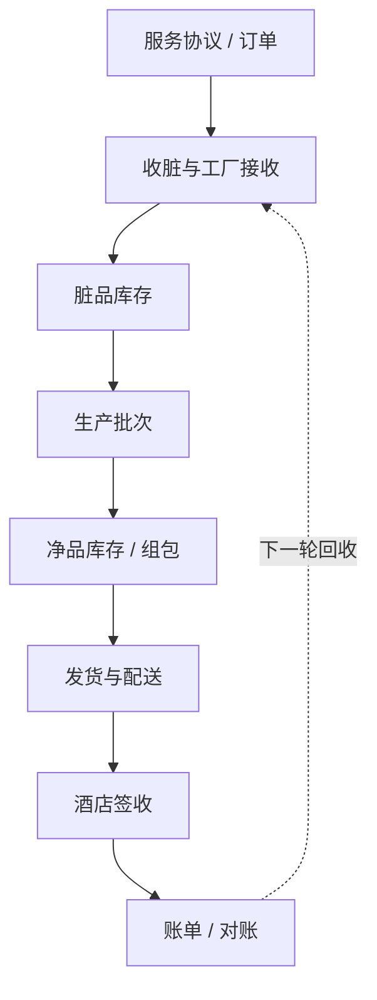
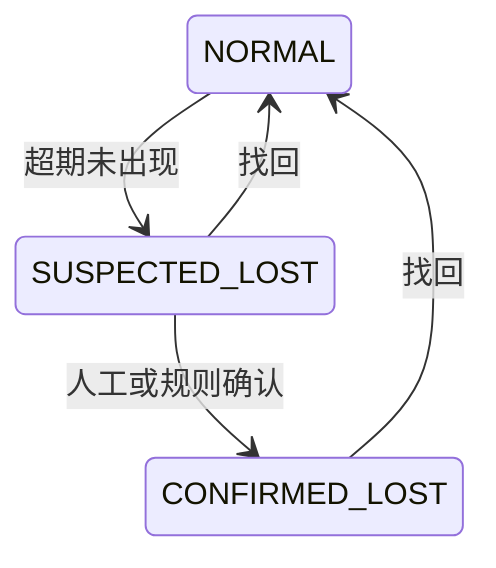
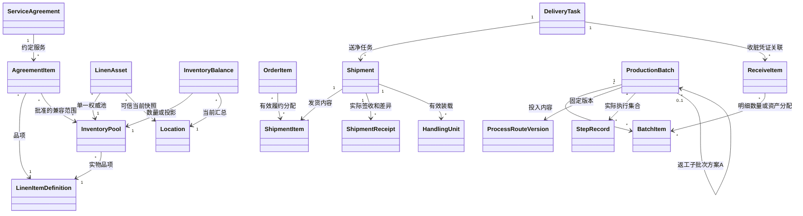

# yixi-saas 洗涤业务领域模型 V1.2

> **版本：** V1.2（完整修订评审稿）  
> **修订日期：** 2026-09-19  
> **文档性质：** 洗涤业务概念模型与后续实现基线；非已批准 DDL 或已完成能力说明  
> **适用项目：** yixi-saas  
> **适用业务：** 租洗、普洗 / 客户自有布草洗涤  
> **关联产品文档：** [《洗涤业务流程与产品需求说明 V1.1》](历史产品需求（一点一版）.md)  
> **代码参照：** `canasher/yixi-saas@6c1a8072a48d7c63056d6852b4c1ee26e3193ecb`（上一轮已核对固定快照，不表示本次重新核验最新 main）  
> **原 V1.1 基线：** `ad11f2cd2ade0cc24b13e280928ea7e8c065e476`，原核对日期 2026-08-29  
> **核心目标：** 小而精、先闭环再扩展，以稳定业务概念吸收差异，避免客户级代码 Fork

**阅读约定：**仓库既定约束、当前源码事实、目标模型和待确认建议分别表述。新增逻辑字段 / 表名用于评审，不表示已建表；涉及产品选择统一引用产品文档第 19 章的 PD 编号，未确认前不得由开发或 AI 工具自行定案。

---

## 1. 文档定位

本文同时回答三个问题：

1. 洗涤业务中哪些概念长期稳定，必须进入业务内核；
2. 不同工厂、不同客户的流程差异如何扩展；
3. 该模型如何落到 yixi-saas 当前代码、企业库和经典三层架构中。

本文是**业务概念模型**，不是要求项目改造为 DDD。实现时继续遵守仓库约束：

- Java 21、Spring Boot 3.3、Maven 多模块；
- 模块化单体和经典三层；
- 业务代码继续位于 `modules/business`；
- 使用 `Controller → Facade → Service → Mapper`；
- 不新增 DDD 聚合框架、通用工作流引擎或微服务基础设施。

本文中的“领域”“领域对象”用于表达业务边界，不对应新的 Maven 模块，也不要求增加 `DomainService`、Repository 等技术层。

### 1.1 固定代码快照与来源

下表为上一轮静态评审使用的来源；本次仅修订文档，没有重新扫描整个仓库、运行构建 / 测试或验证生产环境。

| 依据 | 本版采用的结论 |
|---|---|
| [AGENTS.md](https://github.com/canasher/yixi-saas/blob/6c1a8072a48d7c63056d6852b4c1ee26e3193ecb/AGENTS.md) | 模块化单体、经典三层；平台 / 企业库分离；保留 factory_id；不引入 DDD 框架 |
| [software-design.md](https://github.com/canasher/yixi-saas/blob/6c1a8072a48d7c63056d6852b4c1ee26e3193ecb/docs/software-design.md) | Facade 编排、稳定模块依赖、实时事实 WRITE、显式 @ReadReplica |
| [ADR-0007](https://github.com/canasher/yixi-saas/blob/6c1a8072a48d7c63056d6852b4c1ee26e3193ecb/docs/decisions/0007-v1-single-factory-organization-access.md) | V1 唯一 INITIAL、EmployeeFactory 准入、不开放多工厂产品；保留底层模型 |
| [FactoryProductPolicy.java](https://github.com/canasher/yixi-saas/blob/6c1a8072a48d7c63056d6852b4c1ee26e3193ecb/modules/system/src/main/java/com/yixi/module/system/factory/service/FactoryProductPolicy.java) | 已有 INITIAL 解析校验及外部工厂授权 / 跨厂拒绝逻辑 |
| [current-status.md](https://github.com/canasher/yixi-saas/blob/6c1a8072a48d7c63056d6852b4c1ee26e3193ecb/docs/current-status.md) / [module-map.md](https://github.com/canasher/yixi-saas/blob/6c1a8072a48d7c63056d6852b4c1ee26e3193ecb/docs/module-map.md) | 用于定位能力和入口；“尚未提交”等历史标签不自动等于当前提交或环境状态 |
| [企业库 V1](https://github.com/canasher/yixi-saas/blob/6c1a8072a48d7c63056d6852b4c1ee26e3193ecb/app/yixi-server/src/main/resources/db/migration/company/V1__company_schema.sql) | biz_cloth 是品项，库存为仓库 + 品项；洗涤目标实体尚缺 |
| [企业库 V2](https://github.com/canasher/yixi-saas/blob/6c1a8072a48d7c63056d6852b4c1ee26e3193ecb/app/yixi-server/src/main/resources/db/migration/company/V2__iam_domain_foundation.sql) / [V5](https://github.com/canasher/yixi-saas/blob/6c1a8072a48d7c63056d6852b4c1ee26e3193ecb/app/yixi-server/src/main/resources/db/migration/company/V5__customer_console_organization_foundation.sql) | 复用现有 IAM；已有员工、部门、工厂准入、角色资源 / 数据范围，及员工部门与部门负责人关系 |
| [企业库迁移目录](https://github.com/canasher/yixi-saas/tree/6c1a8072a48d7c63056d6852b4c1ee26e3193ecb/app/yixi-server/src/main/resources/db/migration/company) | 该固定提交已有 V1～V6；新增迁移编号实施时重新确认，平台序列与企业序列分开 |
| [WarehouseInScanRequest](https://github.com/canasher/yixi-saas/blob/6c1a8072a48d7c63056d6852b4c1ee26e3193ecb/modules/business/src/main/java/com/yixi/module/business/warehouse/dto/req/WarehouseInScanRequest.java) / [WarehouseInFacade](https://github.com/canasher/yixi-saas/blob/6c1a8072a48d7c63056d6852b4c1ee26e3193ecb/modules/business/src/main/java/com/yixi/module/business/warehouse/facade/WarehouseInFacade.java) | 现有入口强制 RFID，不能直接承担无 RFID 收货；尚缺稳定请求号 |
| [InventoryStockServiceImpl](https://github.com/canasher/yixi-saas/blob/6c1a8072a48d7c63056d6852b4c1ee26e3193ecb/modules/business/src/main/java/com/yixi/module/business/inventory/service/impl/InventoryStockServiceImpl.java) | 读数量后写回的并发覆盖风险需专项修复 / 验证，不能只依赖 @Transactional |
| [SortingReportRequest](https://github.com/canasher/yixi-saas/blob/6c1a8072a48d7c63056d6852b4c1ee26e3193ecb/modules/business/src/main/java/com/yixi/module/business/sorting/dto/req/SortingReportRequest.java) / [SortingReportFacade](https://github.com/canasher/yixi-saas/blob/6c1a8072a48d7c63056d6852b4c1ee26e3193ecb/modules/business/src/main/java/com/yixi/module/business/sorting/facade/SortingReportFacade.java) | 设备稳定消息号缺口；每次服务端新 ID 不等于终端重发幂等 |

### 1.2 沿用 V1.1 的核心修正

1. **不再假设所有布草都必须建成单件 Asset。**
   租洗和 RFID 场景可以按单件追踪；无 RFID 的普洗必须支持按数量追踪。

2. **将 `biz_cloth` 明确定义为布草品项 / SKU，而不是单件资产。**
   单件资产是未来新增的 `LinenAsset`，两者不可混用。

3. **Asset 不再是所有业务的唯一中心。**
   稳定内核由“品项、可选单件资产、库存、业务单据、生产批次和事实记录”共同构成。

4. **统一 Operation 只做操作上下文和幂等，不做万能业务服务。**
   收货、生产、发货仍由各自 Facade / Service 执行业务规则。

5. **生产 Route 只吸收厂内生产差异。**
   收货、运输、签收使用各自稳定状态机，不塞进一条万能路线。

6. **增加服务协议、追踪策略、所有权、洁净状态等缺失维度。**
   服务模式不能单独决定资产归属、库存责任和结算规则。

7. **补充“现有代码 → 目标概念 → 演进方式”的映射。**
   防止把尚未实现的目标模型误写成当前系统能力。

### 1.3 V1.2 新增修订

统一 V1 单工厂和 IAM 复用；补库存池 / 协议历史、期初库存、部分返洗执行范围、明细来源分配、差异签收和物流结案、收脏任务关系、业务防重和并发约束。同步产品 V1.1 的通用 P0 / 条件 P0 / P1 边界。

新增方案按 PD-011～021 评审，保留原稿内容层级，不引入通用工作流、第二套 IAM 或复杂采购系统。源码事实仅限表中快照；历史状态文档不能替代实现、测试和环境证据。

---

## 2. 核心结论

yixi-saas 的稳定业务骨架应当是：

```text
服务协议
  ├─ 服务模式
  ├─ 资产所有权
  ├─ 追踪方式
  ├─ 库存池适用范围与历史规则快照
  ├─ 计价与责任规则
  └─ 默认生产路线

服务订单
  ↓
收脏 / 接收
  ↓
厂内生产批次 + 路线版本
  ↓
净品库存 / 组包
  ↓
发货 / 配送 / 签收
  ↓
结算与对账
```

库存与历史事实采用双轨：

```text
按数量追踪：
InventoryBalance + InventoryFlow

按 RFID 单件追踪：
LinenAsset 当前快照 + AssetEvent
```

不同工厂的生产差异主要落在：

```text
Route Version
+
Route Step
+
Step Config
+
Gap Policy
+
少量 Step Handler
```

而不是：

```text
FactoryAService
FactoryBService
CustomerXController
客户级独立分支
```

上图是逻辑大循环，不表示每张租洗净品订单必须先收脏。首次租洗可从已确认期初净品库存开始，后续回收属于关联周转；普洗则按本单实际接收和归还责任闭环。

---

## 3. 业务边界

V1 将洗涤业务划分为 10 个概念域。它们是业务职责，不是新的技术模块。

| 概念域 | 主要职责 |
|---|---|
| Master Data | 工厂、酒店、布草品类、品项、设备等基础资料 |
| Service Agreement | 服务模式、所有权、追踪策略、责任和结算约定 |
| Order | 客户需求、订单明细和履约状态 |
| Receiving | 收脏、工厂接收、差异确认和补收 |
| Inventory & Asset | 数量库存、单件资产、库位和库存流水 |
| Production | 生产路线、路线版本、生产批次和步骤执行 |
| Handling Unit | 扎码、包、筐、袋、笼车、吊袋等批量载体 |
| Shipment & Delivery | 配货、装车、运输、签收和司机任务 |
| Exception | 漏扫、数量差异、串货、损坏、返洗、丢失及补偿 |
| Billing | 计费、赔偿、账单、对账和结算；V1 只保留边界 |

### 3.1 三类信息必须分离

| 信息 | 回答的问题 | 典型对象 |
|---|---|---|
| 业务需求 | 客户要什么、双方约定什么 | ServiceAgreement、Order |
| 实物状态 | 布草在哪里、多少、什么质量 | Location、InventoryBalance、LinenAsset |
| 履约过程 | 这批布草经历了什么 | ReceiveOrder、ProductionBatch、Shipment、Event |

业务单据是履约凭证，不是库存状态；库存快照是当前事实，不替代历史记录。

### 3.2 企业、工厂与组织边界

```text
平台库：Company、Account、AccountCompany、开通与数据源
企业独立业务库：
  ├─ Factory / factory_id（保留多工厂结构）
  ├─ V1 唯一可信 INITIAL（运行时产品边界）
  ├─ Employee / Department / EmployeeDepartment
  ├─ EmployeeFactory / EmployeeRole / RoleResource / RoleDataPermission
  └─ 洗涤业务单据、库存、路线、资产和历史
```

每个企业 V1 只使用唯一启用 INITIAL，后端校验不依赖前端隐藏。保留历史非 INITIAL 数据，不自动迁移、删除或授予访问，不增加“一企业只能存在一条工厂”的数据库唯一约束。

### 3.3 复用现有 IAM，不新增平行身份体系

| 既有概念 | 对洗涤业务的作用 |
|---|---|
| Account / AccountCompany | 登录和企业账号准入，不代替企业员工 |
| Employee | 企业内部业务操作者；创建员工不等于创建 Account |
| EmployeeDepartment / main_department_id | 所属部门与主部门，不决定工厂准入 |
| EmployeeFactory | 工厂准入；含超级管理员在内都不能绕过 INITIAL 有效关系 |
| RoleResource | 收货、生产、装车、签收、补偿等功能权限 |
| RoleDataPermission | 当前合法 INITIAL 内的数据范围，不提供跨厂特权 |

Employee 默认工厂不是授权来源。认证失败不补建、启用或恢复已撤销工厂关系。洗涤业务不得扩展遗留用户 / 角色表形成第二套 IAM。

酒店用户的允许酒店范围不由这些关系自动获得，须按 PD-018 增补外部身份映射和服务端校验，或明确本期不开放酒店自助入口。司机是否企业员工及外包关系按 PD-021 确认。

业务模块通过现有稳定权限 / 身份接口使用系统能力；遵守 system 与 business 当前互不依赖边界，不直接互调 Mapper 或制造循环依赖。

---

## 4. 服务协议：先确定规则，再执行流程

仅有 `ServiceMode` 不足以决定所有业务规则。系统需要一个轻量的 `ServiceAgreement` 概念，表达“某酒店与某洗涤厂如何合作”。

### 4.1 服务模式

V1 只定义两个模式：

```text
RENTAL
租洗：由洗涤厂、租赁运营方或第三方提供布草，酒店使用并按约定结算。

CUSTOMER_OWNED
普洗 / 客户自有布草：资产归客户所有，洗涤厂提供收运和加工服务。
```

### 4.2 所有权

所有权与服务模式分离：

```text
FACTORY
CUSTOMER
THIRD_PARTY
```

建议使用：

```text
owner_type
owner_id
```

不能简单规定“租洗必然归工厂”。未来平台资产、第三方租赁资产或联合运营资产都可能存在。

### 4.3 追踪方式

每个库存池必须明确一种权威事实来源，协议明细须声明并校验其适用追踪方式：

```text
QUANTITY
按数量追踪，无需为每件布草建档。

RFID_PIECE
按 RFID 单件追踪，每件布草对应 LinenAsset。
```

同一实物 / 库存池不允许两种模式并存为权威真相。相同品项可在明确隔离的不同池采用不同方式；新建或续签协议不自动创建另一份实物库存。

现有 `biz_cloth.rfid_enabled` 只表示该品项是否具备 RFID 管理能力；实际采用哪种追踪方式，应由协议明细或明确的业务配置决定。

### 4.4 ServiceAgreement 最小内容

```text
agreement_id
company_code
factory_id
hotel_id
agreement_no
status
effective_start
effective_end

agreement_item_id
cloth_id
service_mode
tracking_mode
owner_type
owner_id
default_route_id
billing_policy_code
loss_policy_code
quality_policy_code
# 库存池适用关系、规则快照形式见 4.5 / 4.6，待产品决策后落字段
```

V1 不需要把全部合同条款做成动态规则引擎。先保存决定流程、库存和结算的关键引用即可。

### 4.5 库存池身份与协议解耦（PD-012，待确认）

必须区分三类信息：

| 信息 | 内容 | 约束 |
|---|---|---|
| 实物事实 | 品项、所有者、位置、脏净、质量、追踪方式 | 不随本次订单 / 协议续签任意改变 |
| 池隔离 | 客户专属或允许共享、兼容使用范围 | 普洗客户归属不可丢；租洗共享需批准 |
| 本次履约规则 | 适用协议明细、服务模式、计价及责任引用 | 固定到本次单据，不能替代池身份 |

本版推荐为池引入稳定 `inventory_pool_id`，或由等价的不可歧义维度组合表达；**独立标识与维度组合方案由 PD-012 确认，不能同时保留两套彼此独立的库存键。** 不要求建设复杂“池配置平台”。

建议逻辑内容：

```text
inventory_pool_id             # 采用独立标识方案时
company_code / factory_id
cloth_id
tracking_mode
owner_type / owner_id
customer_scope                # 专属客户或批准的共享范围；逻辑概念，不是已定 DDL
status
```

协议明细与允许池保存兼容关系；`agreement_item_id` 用于履约引用 / 追溯，不再未经确认就固定为所有库存的永久隔离键。普洗仍必须保留实际客户归属，不能用“解耦协议”删除客户维度。

未批准租洗共享时不开放跨酒店取用。续签同所有权、同追踪及兼容专属范围的库存可按决策复用；不兼容时走受控迁移 / 处置，不重建实物，不把旧库存变成无法履约的孤岛。

### 4.6 协议历史、版本与有效期（PD-015，待确认）

订单确认及相关履约事实须保存足够的协议版本或关键规则快照，包括模式、追踪兼容、所有权要求、路线选择依据及计价 / 责任引用。形式可采用不可变版本引用或确认时快照，具体二选一或有明确分工，不能两个字段互相覆盖。

本版优先建议轻量规则快照，不强制先做完整合同版本平台。修改协议不能追溯改写旧单已确认规则；路线版本不可变不代表协议已经有历史保护。

协议到期 / 停用对“新业务”和“既有单据后续收货、返洗、签收”的处理按 PD-015 确认。不论采取何种旧单策略，都不能绕过企业、账号、Session 和 INITIAL 工厂准入。

---

## 5. 布草模型：品项与单件资产分离

### 5.1 LinenItemDefinition — 布草品项

当前代码的 `biz_cloth` 应理解为布草品项 / SKU 定义：

```text
cloth_code
cloth_name
category_code
specification
unit
rfid_enabled
status
```

它回答：

> 这是什么布草？

例如：

```text
客房床单 / 240×280 / 白色 / 件
浴巾 / 80×160 / 600g / 条
```

`biz_cloth` 不是某一条实际浴巾，也不能保存单件生命周期。

### 5.2 LinenAsset — 单件布草资产

只有 `tracking_mode = RFID_PIECE` 时才要求创建 `LinenAsset`。

建议逻辑模型：

```text
id
company_code
factory_id
asset_code
rfid_epc
cloth_id

owner_type
owner_id
inventory_pool_id          # PD-012 推荐方案；替代用当前协议直接充当池身份
origin_agreement_item_id   # 可选来源追溯，不是永久归属或库存隔离的唯一依据

lifecycle_status
loss_status
hygiene_status
quality_status

current_location_id
current_handling_unit_id

wash_count
first_use_at
last_seen_at
last_operation_at

create_time
update_time
deleted
```

不建议在 Asset 快照中保存 `current_route_version_id` 和 `current_route_step_id` 作为主事实。生产路线执行属于 `ProductionBatch` 和步骤执行记录；Asset 只保留必要的当前实物快照。

### 5.3 资产状态必须多维拆分

生命周期：

```text
ACTIVE
SUSPENDED
SCRAPPED
RETIRED
```

丢失：

```text
NORMAL
SUSPECTED_LOST
CONFIRMED_LOST
```

洁净状态：

```text
UNKNOWN
DIRTY
CLEAN
```

质量状态：

```text
NORMAL
HOLD
REWASH
REPAIR
```

“丢失”“脏净”“质量”“是否报废”互相独立，禁止继续扩展成一个超级状态。

### 5.4 资产建立、EPC 绑定和更换

RFID 首客的最小闭环包含资产建档、有效标签绑定、初始位置 / 状态和来源事件。当前企业内一个有效 EPC 只绑定一件有效资产，一件资产至多一个当前有效 EPC；历史绑定可追溯，不用物理删除来复用标签。

换标签与新资产分开：换标保留资产 ID、所有权、生命周期和洗涤次数，记录旧 / 新绑定及原因。未开放维护入口时不允许通过“删旧建新”绕过。具体标签生命周期表或历史事件方式依首客需求确定，唯一有效绑定约束先落实。

批量 RFID 操作数量来自去重后的有效资产集合；一次操作同一件只计一件，不允许单个 EPC 携带任意数量直接增加汇总。

### 5.5 找回不等于恢复可用

可信识别到丢失资产时，记录找回事实和位置并处理 loss_status；lifecycle_status、hygiene_status、quality_status 仍独立校验。未知洁净或质量须隔离 / 待检，已报废资产不能自动变 ACTIVE，已生成赔偿保留关联并交结算边界处理。

---

## 6. Location — 统一库位

Location 回答：

> 实物现在在哪里？

它不回答：

> 实物正在做哪一道加工？

### 6.1 树形结构

```text
企业
├─ INITIAL（V1 唯一可用工厂）
│  ├─ 脏区
│  │  ├─ 待分拣区
│  │  └─ 污物暂存区
│  ├─ 生产区
│  ├─ 净区
│  │  ├─ 净物仓
│  │  └─ 待发货区
│  └─ 异常隔离区
├─ 车辆
└─ 酒店 / 客户库位
```

### 6.2 类型

```text
FACTORY
WAREHOUSE
AREA
PRODUCTION_AREA
CUSTOMER
VEHICLE
TRANSIT
EXTERNAL
OTHER
```

`warehouse_id` 只能表达仓库，无法统一表达酒店、车辆、生产区和异常区。后续业务统一使用 `location_id`；现有 `warehouse_id` 在兼容期可映射到 Location。

### 6.3 Location 与 Process 分离

示例：

```text
Location：INITIAL / 生产区 1
Process：WASH
```

同一位置随后可以执行 `IRON`。新增工艺原则上不增加库存状态或 Location 类型。

### 6.4 厂外位置与未知位置

酒店、车辆等物理上位于厂外，但仍在当前企业业务及合法 INITIAL 范围下管理，不是跨工厂或跨企业授权。

差异签收、短缺或离线补录不能虚构当前位置。保留最近可信位置和“待确认”异常；如采用专门待确认库位，它只表达管理占位而非已知实物位置，必须有可辨识语义。具体表示按 PD-013 确认，不将短缺资产直接放进酒店正常可用库存。

---

## 7. 双轨库存模型

### 7.1 按数量追踪

`tracking_mode = QUANTITY` 时，以 InventoryBalance 和 InventoryFlow 管理数量，不为每件布草建立虚假 Asset。

推荐逻辑库存键（采用 PD-012 独立池标识方案时）：

```text
company_code + factory_id
+ inventory_pool_id
+ location_id
+ hygiene_status + quality_status
```

池定义须能唯一解析品项、追踪、所有者和客户专属 / 共享规则；若按查询需要冗余保存这些字段，必须与池定义一致。采用维度组合方案时，保留等价且完整的隔离维度，不能漏掉普洗客户归属。

**此处取代旧稿把 `agreement_item_id` 无条件放入全部库存键的建议，不是已批准删字段或迁移指令。** 协议引用在履约明细 / 快照中保留；池方案批准后再确定唯一键、存量迁移和对账。

现有 `biz_inventory_stock` 按 `company_code + factory_id + warehouse_id + cloth_id` 汇总，不足以区分归属、脏净和质量，不能直接当作完整模型。

### 7.2 按 RFID 单件追踪

`tracking_mode = RFID_PIECE` 时，LinenAsset 当前实物快照为明细真相，AssetEvent 记录历史；InventoryBalance 只作可重建汇总。不得允许独立人工修改 RFID 汇总形成第二套真相。

实时业务移动建议在同一企业库事务更新资产、有效占用、事件和实时汇总；异步统计只用于明确接受延迟的报表。需要查询实时库存时不得把异步汇总或 READ 副本当作当前实物事实。投影重建和修复必须与单件明细对账并保留审计。

### 7.3 数量、预留和可用量（PD-020，待确认）

```text
on_hand：当前库存维度内实物现存量（可映射现有 quantity）
reserved：有效备货预留量（可映射现有 locked_quantity）
available：允许发货的状态桶内 on_hand - reserved
```

上面是逻辑口径，不是要求立刻重命名现有字段。脏品、隔离、质量不合格如已分桶排除，不再在公式中重复扣减；不得把酒店持有量计为工厂可发库存。单件模式由符合状态条件且未被有效占用的资产集合确定可用。

| 操作 | 必须保持的事实 |
|---|---|
| 下单 | 不直接变化实物数量或位置 |
| 备货确认 | 新增有效数量预留 / 单件占用，不提前移到酒店 |
| 撤销备货 | 只释放对应预留，实物不凭空增加 |
| 装车 | 实装内容移动到车辆，转换 / 释放原预留，不重复扣量 |
| 签收 | 实收部分从车辆移到酒店；其他内容保留真实去向 / 待确认 |
| 退回 / 更正 | 新增关联事实和逆向 / 更正流水，不删除原流水 |

预留须能追到发货明细 / 分配事实，不能只有一个无法解释来源的总数。并发后仍满足非负、预留不超合法可用范围及单件唯一有效占用。

### 7.4 期初库存与资产初始化（PD-019）

首版需要经授权的期初录入 / 导入及确认，不扩成采购系统。数量模式保存品项、池 / 归属、库位、脏净、质量、数量和导入来源，确认后生成 INITIAL 类型的来源流水；该来源类型为建议逻辑命名，实施时与现有枚举统一。

RFID 模式建立稳定资产、唯一有效标签、初始位置 / 状态及事件，汇总由资产事实得出。未知归属或未校验标签进入待确认，不自动补造客户与资产。

区分“同次导入重试”和“后来另一次合法补充”：前者去重，后者必须有独立批准来源。来源行 / 导入批次有稳定标识；人工换请求号不能重复确认相同期初数据。

确认人、基准时点、历史已有量处理及冲正方式按 PD-019 确认。确认后的初始化不能直接重跑为第二份余额。

### 7.5 并发正确性与流水

固定代码快照的 `increase` 采用读数量后写回，存在并发覆盖更新的静态风险；本次没有运行压力测试，不宣称已发生事故或已修复。

目标实现必须以原子条件更新、合适行锁或明确版本条件等机制保证竞争正确；选择方案时同时覆盖首次建行竞争、扣减不足、预留冲突和同一资产占用。不能只添加 `@Transactional` 就认定并发安全。

每次成功操作在同一企业库事务中保存余额 / 资产状态、占用、单据状态和对应流水 / 事件。不同请求分别加 10、20 必须累计加 30；相同请求重试只加一次。流水记录与最终余额可对账，失败事务不留下半份正常库存事实。

### 7.6 禁止双重真相

QUANTITY 的余额与流水是权威；RFID_PIECE 的资产明细是权威、汇总为投影。期初导入、人工调整、拆包和签收全部遵守同一事实来源，不存在“快速改汇总”和“单件移动”两条彼此不一致的捷径。

---

## 8. 稳定业务大循环



稳定的是外层循环，变化最大的是厂内生产。

### 8.1 单据之间禁止强制一一对应

实际业务可能出现：

- 一个订单分多次收货；
- 多个收货单合并成一个生产批次；
- 一个生产批次包含多个酒店或多个订单的布草；
- 一个订单拆成多次发货；
- 一辆车同时执行多个发货单。

因此，数据库和业务规则不得默认：

```text
Order = ReceiveOrder = ProductionBatch = Shipment = DeliveryTask
```

FR-105 已把拆批履约列入首版，首版就须保存可追到明细的分配关系，不能等拆批发生后才补。跨酒店合批按 PD-004 确认，图中关系容量不表示已开放任意混批。

### 8.2 明细来源分配

最小关系必须表达：

```text
收货明细 → 生产批次明细：本次分配数量 / 资产集合
订单明细 → 发货明细：本次履约数量 / 资产集合
父生产明细 → 返工执行：拆出数量 / 资产集合及原因
任务明细 → 收脏或发货凭证：执行类型和业务来源
```

每个关系保留来源 / 目标明细、分配数量或资产集合、状态、时间和操作引用；数量模式不能只留主单号。约束有效分配不得超过可分配量；同一资产不能同时进入两个互斥的有效执行 / 发货占用。

建议按业务包建立有明确含义的关系，而不是另建万能多态关系引擎。撤销合法未执行分配时保留历史，已消费部分不能再次分配或通过删除关系隐藏。

---

## 9. Order — 服务订单

Order 回答：

> 客户本次提出了什么需求？

订单不是生产流程，也不是库存流水。

### 9.1 建议状态

```text
CREATED
CONFIRMED
IN_FULFILLMENT
COMPLETED
CANCELLED
```

上述为目标状态。原 V1.1 基线记录的订单骨架只有 `CREATED / CONFIRMED / COMPLETED / CANCELLED`；本次未重新逐类核验订单枚举，实施前须对照实际版本补 `IN_FULFILLMENT` 等差距，不用生产步骤名称扩充订单状态。

### 9.2 订单明细

订单明细引用：

```text
agreement_item_id
agreement_rule_snapshot  # 或不可变规则版本引用，PD-015 决定形式
cloth_id
quantity
unit_price
amount
```

V1 建议一张订单只包含一种 `service_mode`。若未来必须混合租洗和普洗，再允许行级模式，不提前扩大复杂度。

### 9.3 两种模式的完成条件

租洗沿用“本单净品实际交付完成”，后续收脏不阻塞该次净品订单；特殊合同仍按经批准规则，不修改通用订单状态。

普洗建议依据“本单应承担处理责任量 = 已确认归还量 + 已批准结案处置量”，并排除阻塞性的返洗、短缺和待确认事项后完成，具体应处理量计算及批准条件按 PD-014。原订单、申报和实收数量保留，另记批准调整，不能覆盖历史数量。

发货物流结案不自动清除订单欠量；已收 100、归还 98、2 件报损待确认不直接完成。结算支付与业务履约状态分开。

### 9.4 明细履约进度

订单明细汇总有效收货、投入、已归还 / 已交付及批准处置，不简单相加所有步骤 input_quantity 或所有历史分配。返工是同批实物再次加工，不等于新增客户交来数量。具体进度字段可查询派生，避免另建可独立随意修改的“完成量”。

---

## 10. Receiving — 收脏与工厂接收

当前 `biz_warehouse_in` / `biz_warehouse_in_item` 可以作为 V1 接收单骨架继续演进，无需再平行创建一套意义相同的收货表。

建议补充：

```text
receive_scene
source_location_id
target_location_id
hotel_id
agreement_id
tracking_mode
request_id
occurred_at
```

### 10.1 ReceiveScene

```text
NORMAL
FACTORY_COMPENSATION
PRODUCTION_COMPENSATION
MANUAL_COMPENSATION
```

产品界面的 A / B / C 单映射为：

```text
A → NORMAL
B → FACTORY_COMPENSATION
C → PRODUCTION_COMPENSATION
```

A / B / C 是业务展示和场景分类，不是三套底层流程。

### 10.2 数量差异必须显式记录

接收至少保留：

```text
declared_quantity
received_quantity
difference_quantity
difference_reason
confirmed_by
confirmed_at
```

对于 RFID 模式，还要记录：

```text
expected_asset_count
received_asset_count
unknown_rfid_count
wrong_owner_count
```

补偿操作必须记录操作人、原因、来源节点和关联单据，不能静默修改库存。

### 10.3 数量入口与 RFID 入口

现有 WarehouseInScanRequest 和 Facade 要求 RFID 非空。无 RFID 普洗需增加数量收货入口或明确模式分支，不要求伪造标签或 Asset；数量字段的正值、非空、单位按 PD-002 对应模式校验。

RFID 接收以去重后的有效资产集合为准，明确未知标签、归属冲突及本轮已有有效接收的处理。单个有效 EPC 不携带任意数量增加库存。

### 10.4 酒店、司机与工厂交接事实

分别保存酒店申报、司机实收和工厂实收，以及各自时间、操作者 / 交接人和差异。可复用收货体系内的交接记录，不必再建第二套语义相同的收货单。

收脏任务与交接 / 收货凭证的最小关联按 PD-021 确认，不能用仅有的 delivery_task_shipment 表达所有收脏。司机已接收不等于工厂已接收，不直接提前写入工厂脏品库位。

### 10.5 本轮有效事实与补偿

稳定 request_id 解决重试；同轮收货业务还需有可识别的来源单据 / 周转上下文和已生效内容约束。单纯 RFID 永久唯一会阻止正常反复周转，不能采用。

B/C 共用已批准 GapPolicy。C 推荐人工确认但待 PD-017；自动只补有充分证据的允许事实。未知来源、品项、数量或时序冲突不自动入正常库存，历史补收不覆盖更晚位置。

---

## 11. ProductionRoute — 厂内生产路线

Route 只解决：

> 布草进入工厂后，按什么生产步骤加工？

收货、司机派车、配送签收不放入 ProductionRoute。

### 11.1 路线匹配

V1 匹配优先级：

```text
协议明细指定路线
  ↓
工厂 + 服务模式 + 布草品类
  ↓
工厂 + 服务模式默认路线
  ↓
企业默认路线模板
```

若平台提供行业模板，应在企业开通或配置时复制为企业库内的路线版本。企业业务运行时不得跨库读取平台默认路线。

### 11.2 路线必须版本化

```text
ProcessRoute
  ├─ route_code
  ├─ route_name
  └─ 当前发布版本

ProcessRouteVersion
  ├─ version_no
  ├─ status
  └─ immutable_after_publish

ProcessRouteStep
  ├─ step_code
  ├─ sequence
  ├─ step_kind
  ├─ process_code
  ├─ required
  ├─ repeatable
  ├─ gap_policy
  ├─ rework_target_step_code
  ├─ handler_code
  └─ config_json
```

规则：

```text
已进入生产的批次 → 固定原 route_version_id
新批次 → 匹配当前已发布版本
已发布版本 → 禁止原地修改业务语义
```

### 11.3 V1 只支持受控线性路线

`StepKind`：

```text
MOVE
PROCESS
CHECK
GROUP
UNGROUP
```

`process_code` 示例：

```text
SORT
WEIGH
PRETREAT
WASH
DEHYDRATE
DRY
IRON
FOLD
STERILIZE
QC
REPAIR
```

V1 支持：

- 顺序步骤；
- 可选步骤；
- 可重复步骤；
- 质检失败后退回指定前序步骤；
- 流程缺口策略；
- 少量固定 Handler。

V1 不支持任意 DAG、并行网关、脚本表达式或动态代码。

### 11.4 路线变更、返工和证据

返工是既有批次的派生执行，继续引用原固定 route_version_id，并从原版本配置的目标步骤开始。新独立批次才按最新已发布版本匹配，不能在拆返工子批次时意外套用新路线。

GapPolicy 不是伪造生产事实的权限。MOVE / 交接的可补范围与 WASH、消毒、QC 完工的证据分开；有可信完工证据可幂等重放，否则人工确认或拒绝。缺口策略不能绕过既定安全、客户归属和状态校验。

---

## 12. ProductionBatch — 生产批次

一个批次固定一个不可变 route_version_id。**批次头 current_step_id 只适合描述同进度执行范围或汇总，不能单独代表全部内容物的进度。** 部分合格、返洗、修补必须定位到数量明细或实际资产集合。

### 12.1 逻辑模型与执行粒度（PD-011）

保留原批次、明细和步骤记录，补执行范围与来源约束：

```text
production_batch
  id / company_code / factory_id / batch_no
  route_version_id / tracking_mode / status
  current_step_id                # 展示或同进度范围，不是所有单件的唯一进度
  started_at / completed_at

production_batch_item
  id / batch_id
  agreement_item_id / agreement_rule_snapshot
  inventory_pool_id             # PD-012 方案确认后落定
  cloth_id / owner_type / owner_id
  input_quantity
  qualified_quantity
  pending_rework_quantity
  pending_disposition_quantity
  disposed_quantity

production_batch_asset          # RFID 条件能力
  id / batch_id / batch_item_id / asset_id
  allocation_status

production_step_record
  id / batch_id / route_step_id / attempt_no
  status / input_quantity / output_quantity
  started_at / completed_at
  operator_id / device_id / request_id

production_step_record_item
  step_record_id / batch_item_id
  input_quantity / qualified_quantity / rework_quantity / disposition_quantity

production_step_record_asset    # RFID 条件能力：本次真实执行集合
  step_record_id / asset_id / result
```

上述为本版**建议逻辑字段 / 关系**，不是直接可执行 DDL。新增结果分量的最终命名及是否派生查询，由 PD-011/014 与技术设计确认；各分量必须有清楚口径，不能把累计返洗次数、待返工库存和最终结果混成一组可直接相加的数。

### 12.2 部分返洗二选一方案

| 方案 | 需增加的最小含义 | 边界 |
|---|---|---|
| A：关联返工子批次（优先建议） | parent_batch_id / root_batch_id、返工来源步骤、目标步骤、来源分配及受影响内容 | 子批次只装实际返工部分，沿用原路线版本；不把父批次全量搬入子批次 |
| B：同批次执行分组 | execution_scope_id、范围内容、范围级当前进度和步骤记录关联 | 批次头仅汇总，范围内保持受控线性；不建设通用并行流程引擎 |

PD-011 批准后选一种落表，不同时实施两套生产进度真相。无论哪种，都要把每条步骤记录与本次参与的明细 / 资产集合绑定，不能只记录一个不知对应谁的“完成 10 件”。

### 12.3 90 件合格、10 件返洗

```text
原批次投入 100
  ├─ 90 件已合格：按批准规则独立放行、入净品库存、可参与发货
  └─ 10 件返洗：分配到返工子批次或执行分组，回指定步骤
       └─ 真正再次 WASH 完成，只对该 10 件计洗
```

拆分动作本身不新增实物，不增加产量，不改变客户归属。有效分配总量受原可分配内容约束；同一资产不能同时在父批次和子批次处于互斥的活动执行。

采用 A 时，“转入子批次”是责任转接，不是已报损或已归还。父批次自身执行完成可与派生责任链完成分开展示；父子未决项仍参与原订单履约判断。正式完成条件由 PD-011/014 确认，不能因父批次状态结束而丢掉返洗责任。

### 12.4 洗涤计次

```text
本次执行集合真实完成 WASH
→ 产生可追溯 WASH_COMPLETED
→ 仅集合内 LinenAsset.wash_count + 1
```

去重须绑定稳定步骤执行身份与资产，可使用：

```text
company_code + asset_id + production_batch_id + route_step_id + attempt_no
或 company_code + asset_id + step_record_id（step_record 本身已业务幂等）
```

采用子批次时，本地 attempt_no 可从 1 开始，但完整执行身份包含子批次及原来源；不能只按 asset_id + attempt_no 跨批次去重。真实新返洗独立执行、再次计洗；旧事件重试不能再计一次。

数量模式只记录批次 / 执行范围的数量与真实加工尝试，不虚构单件生命周期。返洗加工次数可以累积，但最终合格实物量不因反复加工重复增加。

### 12.5 结果守恒与完成

每次执行输入必须能解释为互斥结果：合格输出、待返工 / 修补、隔离待确认或已批准处置，具体枚举和批准边界按产品决策。中间状态与最终处置不得双计。

关联订单的归还 / 处置量从有效履约事实汇总，而非简单相加所有历史步骤 output_quantity。物流或生产某个子单完成不代替整单责任结清。

---

## 13. HandlingUnit — 批量载体

统一抽象：

```text
BUNDLE
BASKET
BAG
TROLLEY
HANGER
PALLET
```

HandlingUnit 可以装：

```text
RFID 模式 → Asset[]
数量模式 → Item + Quantity[]
```

推荐关系：

```text
handling_unit
handling_unit_asset
handling_unit_item
```

V1 约束：

1. 同一 Asset 同时最多属于一个有效 HandlingUnit；
2. 同一 HandlingUnit 只使用一种 tracking_mode；
3. V1 不支持 HandlingUnit 嵌套；
4. 重新组包必须先解绑旧关系，再绑定新关系；
5. HU 整体移动时，其内容物同步移动；
6. 关闭后的 HU 关系保留历史，不物理删除。

禁止把“已扎码”直接塞进 RFID 或 Asset 的超级状态。

### 13.1 内容物预留与移动

数量 HU 明细必须保留库存池 / 客户归属及来源分配，不仅有品项和数量。RFID HU 操作以当前有效资产集合为准。HU 是批量操作载体，不是新的独立库存真相。

备货锁定须作用于 HU 内容物及其真实库存 / 资产，避免同一内容既被 HU 又被单件发货重复占用。拆包、换包、撤销和装车在同一企业库事务内维护有效关系、预留及实际移动，历史绑定保留。

V1 人工组包、查看、拆包为通用闭环；RFID HU 关系为条件 P0；自动搬运、嵌套和载具资产折旧不是本版首发要求。

---

## 14. Shipment 与 DeliveryTask 分离

| 概念 | 回答的问题 |
|---|---|
| Shipment | 哪些货从哪里到哪里、实际装了多少、实际交付多少、差异如何处理 |
| DeliveryTask | 司机 / 车辆按什么任务执行收脏或送净，关联哪些业务凭证 |

现有 biz_delivery_task 仅有基础订单 / 酒店关联，不能替代发货内容、拆批分配或收脏交接模型。

### 14.1 状态与签收结果

原目标流程保留：

```text
CREATED → PICKING → READY → LOADED → IN_TRANSIT → DELIVERED
装车前合法撤销 → CANCELLED
```

**PD-013/020 待确认建议：**增加 CLOSED 表达“含差异但已完成物流处置”，或用独立结案字段表达同一含义。DELIVERED 只表示实际全量交付，不将退回 / 短缺也伪装为已送达。新增 CLOSED 不是已实现枚举，正式字段形态须批准。

部分签收保留未决状态和明细进度，不直接标全量交付。已装车不直接取消，应走卸车、退回或差异处置；差异物流结案仍不自动完成原订单欠量。

### 14.2 内容、签收及任务关系

建议关系：

```text
shipment / shipment_item
shipment_handling_unit
shipment_receipt / shipment_receipt_item      # 实际签收与差异凭证，具体表形态待技术设计
shipment_receipt_asset                       # RFID 条件关系
shipment_disposition                        # 差异处置或等价的可审计业务记录
order_item_shipment_allocation               # 拆批抵扣，具体表名为建议

delivery_task
delivery_task_shipment                      # 送净来源关系
任务收脏明细 → 交接 / 收货凭证               # 单独收脏必须有关系，PD-021 决定复用方式
```

可以采用按任务类型分开的明细关系，也可在任务明细中明确 PICKUP / DELIVERY 及合法来源，但不能因追求泛化建立任意对象关系引擎。单任务收送混合按 PD-006 决定是否首发。

每个有效 Shipment 明细 / HU 的内容清楚且不能重复分配；数量模式保留订单明细抵扣量，RFID 模式保留实际资产集合。

### 14.3 实发、实收和差异

```text
shipped_quantity             # 原有效实发量，不用实收覆盖
received_quantity            # 累计有效实收量
unresolved_difference        # 尚未处置差异
refused / missing / pending  # 互斥差异分类，具体字段 / 枚举由 PD-013 确认
```

原实发减累计有效实收等于未交付差异；差异分类不能相互重复。签收可有多次有效凭证，每次只处理尚未确认内容；错误签收使用有权限的更正 / 冲正，不删除原记录。

例：装车 100、确认实收 98，只将 98 移到酒店。其余 2 有可信仍在车辆事实则保留车辆待退，已退回则记录实际退回；位置未知则保留最近可信位置和待确认异常，不凭空移入酒店正常库存。

差异转入责任处置、补送或退回须保留原单关系。物流处置批准不自动表示客户已经收到，也不自动抵扣原订单未完成量；按 PD-013/014 决定是否补送或批准责任调整。

### 14.4 库存事务边界

备货确认只产生预留。装车时在同一企业库事务移动实装内容到车辆并转换 / 释放预留；签收时同事务移动实收内容到酒店并保存签收事实、单据状态和流水 / 资产事件。

不能先把整单内容移到酒店，再靠异步任务把未收到的部分“减回去”。退回、更正与原单通过独立事实关联，并按各自操作保持事务一致。

### 14.5 司机收脏与交接

单独收脏任务关联酒店交接、司机实收与工厂接收凭证，保留分环节数量和责任人。司机可能为内部 Employee 或批准的外包身份，不能依据请求传入 driver_id 直接授予操作权。

同任务收送当前仅预留，未完成 PD-006/021 及 UAT-21 前不得标为已实现。

---

## 15. Exception — 异常与补偿

异常不是正常流程的另一个分支副本。

V1 建议统一异常类型：

```text
MISSING_SCAN
DUPLICATE_SCAN
QUANTITY_DIFFERENCE
UNKNOWN_RFID
WRONG_OWNER
WRONG_CUSTOMER
QUALITY_FAILED
REWASH_REQUIRED
DAMAGED
SUSPECTED_LOST
CONFIRMED_LOST
DEVICE_OFFLINE
MANUAL_CORRECTION
```

异常记录至少包含：

```text
exception_type
source_type
source_id
asset_id / cloth_id
expected_value
actual_value
status
resolution_type
reason
reported_at
resolved_at
reported_by
resolved_by
```

### 15.1 GapPolicy

只针对可识别的前置步骤缺口：

```text
AUTO_COMPENSATE
CONFIRM_COMPENSATE
REJECT
```

自动补偿也必须生成补偿事实，记录“系统补了什么、为什么补、依据是什么”。

### 15.2 丢失



可信入口重新识别可进入统一找回处理；上图仅表达 loss_status，不代表生命周期、洁净、质量全部恢复。保留可信位置和找回事件，未知质量 / 洁净进入 HOLD 或待检；已 SCRAPPED / RETIRED 不因找回自动恢复 ACTIVE。赔偿、回购和扣款进入 Billing，不从丢失状态直接推导。

### 15.3 补偿证据与时序

GapPolicy 的 B/C 默认及允许自动范围按 PD-017 确认；本版推荐 C 人工确认，不默认为已经批准。补偿记录关联原始设备 / 人工证据、缺失步骤、发生时间、接收时间、执行人和被影响内容。

允许补记可证明的交接 / 收货；缺客户、品项、数量或来源证据不自动入账。不能因为下游扫描就补出 WASH、消毒或 QC 合格；可信完工消息可幂等重放真实步骤，不等于凭空补造。

迟到数据需比较业务顺序和已生效事实。历史记录补齐与当前快照推进分开；不能简单按接收时间覆盖 last_operation 或当前库位。冲突进入人工复核，避免把当前资产倒退到历史位置。

### 15.4 异常关闭与责任链

异常解决记录必须能关联实际库存 / 资产处置和履约责任，不只是把 status 改为 CLOSED。部分签收、返工转接和报损审批后是否解除订单阻塞按 PD-013/014；未批准的报损不自动冲减原责任。

---

## 16. 操作、幂等与历史事实

### 16.1 不建设万能 OperationService

各业务入口仍保持清晰编排：

```text
ReceiveController → ReceiveFacade → ReceiveService
ProductionController → ProductionFacade → ProductionService
ShipmentController → ShipmentFacade → ShipmentService
```

统一的是操作上下文：

```text
request_id
operation_code
source_type
operator_id
device_id
occurred_at
company_code
factory_id
```

而不是把所有规则塞进一个巨型 Service。

### 16.2 请求、业务和并发三层控制

| 层次 | 防什么 | 最小要求 |
|---|---|---|
| 传输幂等 | 同请求 / 设备消息重发、响应丢失 | 稳定请求键、内容校验、状态及结果引用，成功重试返回原结果 |
| 业务防重 | 换请求号重复确认同一事实 | 本轮有效收货、同一次步骤尝试、同次预留 / 签收内容有业务身份 |
| 并发互斥 | 两个真实请求竞争同一余额或资产 | 原子约束 / 锁 / 版本控制，不超分配、不负库存、不重复占用 |

推荐请求键：

```text
company_code + factory_id + source_type + source_instance_id
+ operation_code + request_id
```

source_instance_id 表达设备或已验证来源；若请求 ID 保证全局 UUID，可按明确契约简化作用域，但不能把设备局部序号当全局唯一。相同键、不同内容应拒绝；请求主体摘要按规范化内容生成，避免只凭 ID 返回不相干结果。

幂等记录应关联结果单据 / 事实及处理状态。业务成功但响应丢失时能恢复第一次结果；处理中、失败及可重试语义明确。业务效果与本地幂等成功记录需同一企业库事务，不用独立提前“成功”标记掩盖业务失败。

RFID 防重限定本轮有效收货 / 周转或步骤执行，不能永久按 RFID 去重。真实新轮回厂应允许；相同轮即便换请求号也不重复入账。

固定代码快照尚有缺口：WarehouseInScanRequest 无稳定 request_id；SortingReportRequest 无设备稳定 message_id，服务端每次新 ID 无法识别终端重发。已有内部日志 / 消费去重不能自动覆盖入口幂等，落地时须沿完整链路核验。

### 16.3 历史事实按职责保存

不建立一个包办所有业务的万能 Event 表：

| 当前事实 | 历史事实 |
|---|---|
| LinenAsset | AssetEvent |
| InventoryBalance | InventoryFlow |
| ProductionBatch / 受控执行范围进度 | ProductionStepRecord 与实际参与明细 / 资产集合 |
| Shipment 当前状态 | ShipmentStatusRecord 或关键操作记录 |
| 异常当前状态 | ExceptionRecord |
| 对外可靠通知 | OutboxMessage |

当前状态直接查询，历史用于追溯；不采用完整 Event Sourcing。

### 16.4 操作者身份与上下文

统一操作上下文补充 actor_type / source_instance_id 等来源区分。对企业内部人工动作，原有逻辑 operator_id 表达 Employee 身份；需要同时追踪登录 Account 时另存可信引用，不把两种 ID 混填同字段。设备、系统任务和酒店外部签收采用各自来源，不伪造 Employee。

具体字段与当前项目 DTO / 审计兼容设计时确认；历史操作者不随调岗、离职改写。当前权限每次由可信会话 / 来源判定，不能拿旧操作快照作为继续访问的授权。

HTTP、MQ、异步和 Job 携带、恢复并清理 company_code / factory_id；设备先确定可信企业和 INITIAL，不用 RFID、请求体 companyCode 或任意 header 猜测数据源。

### 16.5 原始上报与可靠后续处理

设备上报受理和业务完成分开表达。原始记录已保存并不保证 MQ 已发送；需可靠异步通知时，在企业库本地事务中记录业务事实与 Outbox 或等价可恢复发送任务，再由本地 / MQ 传输重试，消费者按稳定业务键去重。

不能把平台侧已有 Outbox 自动视为所有洗涤入口均已接线。方案复用项目可选消息接口，local 无 RabbitMQ 也能工作；Facade 不直接绑定 RabbitTemplate，不声明跨库 / 跨网络原子事务。

---

## 17. 核心业务不变量

以下规则应进入开发规范和测试：

1. 企业业务只运行在当前企业库，未知企业不得回落平台库。
2. V1 厂内业务仅使用可信 INITIAL；员工含超管均需有效 EmployeeFactory，功能 / 数据权限不能绕过工厂准入。
3. 同一库存池只能有一种权威 tracking_mode。
4. `QUANTITY` 以 InventoryBalance 为真相，`RFID_PIECE` 以 LinenAsset 为明细真相。
5. 一个有效 Asset 同时只有一个 current_location。
6. Location、Process、洁净状态、质量状态和丢失状态相互独立。
7. 一个 Asset 同时最多属于一个有效 HandlingUnit。
8. 一个 HandlingUnit 同时最多绑定一个有效 Shipment。
9. 已发布 RouteVersion 不允许原地修改。
10. 生产批次进入生产后固定 RouteVersion。
11. 洗涤次数只能由实际完成的 WASH 步骤驱动。
12. 同一洗涤步骤尝试不得对同一 Asset 重复计次。
13. 业务请求、设备消息和 MQ 消费必须有稳定幂等键。
14. 补偿必须可审计，禁止静默改库存或伪造正常操作。
15. 单据状态变化和对应库存移动必须处于同一企业库事务。
16. 订单、收货、生产批次、发货和配送任务不得强制一一对应。
17. 实时 RFID、库存、库位、订单和生产状态查询固定使用 WRITE。
18. 平台模板进入企业业务前必须复制到企业库，运行时不跨库读业务配置。
19. 对外 Long 型 ID 和 Version 继续按项目规范使用十进制字符串。
20. 客户和工厂差异禁止通过复制 Controller / Service 实现。
21. 同一实物只有一个权威库存池；协议续签不重建资产、不擅改所有权或历史规则。
22. 部分返洗只作用于明确数量 / 资产集合，已合格部分不重新退回或重复计产。
23. 返工执行沿用原路线版本，来源和责任转接可追溯。
24. 拆批在首版就保留明细分配，有效分配不超过可分配量。
25. 只有实际签收内容进入酒店库存；差异和未知位置不能伪造成全量交付。
26. 待确认报损 / 返洗不等于普洗责任结清，物流结案不自动完成订单。
27. 期初录入 / 导入有独立授权、来源和流水 / 事件，重复确认不增量。
28. 请求防重、业务防重和并发竞争分别验证，@Transactional 不替代并发约束。
29. 找回只处理丢失维度及可信位置，不自动解除质量隔离或报废状态。
30. 不从下游扫描虚构洗涤 / 消毒 / 质检完成，迟到事实不倒退当前快照。
31. 员工、部门、角色与权限复用现有 IAM，酒店授权另行定义，不存在第二套身份真相。
32. 业务建议的具体执行方式以 PD 决策为准，不能把建议表名和状态写成已实现。

---

## 18. 概念关系



该图表达目标逻辑，不是当前数据库 ER 图。InventoryPool 的独立标识 / 维度组合按 PD-012，子批次方案 A 按 PD-011，收脏凭证的实际表级关联按 PD-021。图中多对多不自动开放跨酒店共享或合批，也不要求一次创建所有条件能力表。

---

## 19. 与当前项目的映射

| 当前代码 / 表 | 当前真实含义 | 目标概念 | 处理建议 |
|---|---|---|---|
| `biz_factory` | 工厂事实模型 | Factory | 复用；V1 仅 INITIAL；不为单工厂删结构或新增单行数据库约束 |
| `biz_hotel` | 酒店基础资料 | Customer / Hotel | 继续使用 |
| `biz_cloth` | 布草品项、规格 | LinenItemDefinition | 继续使用，不把它当单件 Asset |
| `biz_order` / `biz_order_item` | 通用订单骨架 | ServiceOrder | 增加协议引用和真实履约状态 |
| `biz_warehouse_in` / item | 强制 RFID 的扫码入库骨架 | ReceiveOrder | 演进复用；补无 RFID 数量入口、场景、稳定请求号、交接差异和分配关系 |
| `biz_inventory_stock` | 仓库 + 品项数量库存 | InventoryBalance | 按批准池规则扩维，补预留与并发正确性；不直接采用旧协议键建议 |
| `biz_inventory_flow` | 数量库存变更流水 | InventoryFlow | 继续使用并扩充来源和 Location |
| `biz_sorting_record` | RFID 分拣结果 | ProductionStepRecord 的一种 | 保留设备原始事实，不把它当完整生产路线 |
| `biz_device_report_log` | 设备原始上报 | DeviceOperationLog | 继续使用，补设备侧幂等 ID |
| `biz_delivery_task` | 基础配送任务骨架 | DeliveryTask | 保留，首版补 Shipment 和单独收脏凭证关系；不默认为已支持多单收送 |
| `biz_terminal_device` | 终端设备 | Device | 继续使用 |
| 暂无 | 服务规则 | ServiceAgreement | 新增 |
| 暂无 | 统一库位 | Location | 新增 |
| 暂无 | RFID 单件资产 | LinenAsset / AssetEvent | RFID 业务阶段新增 |
| 暂无 | 厂内路线 | Route / Version / Step | 新增 |
| 暂无 | 生产执行 | ProductionBatch / StepRecord | 新增 |
| 暂无 | 批量载体 | HandlingUnit | 新增 |
| 暂无 | 发货内容 | Shipment | 新增 |
| 暂无 | 异常与补偿 | ExceptionRecord | 新增 |
| 暂无完整洗涤接线 | 跨入口幂等 | OperationRecord | 新增或按包建立请求 / 业务键，沿入口到消费核验 |
| 现有 IAM 关系 | 员工、部门、角色、工厂准入、数据范围 | 业务身份与权限 | 复用，不再新建洗涤员工 / 角色体系 |
| 暂无完整洗涤能力 | 池身份、期初来源、明细分配及签收差异 | 本版补充目标概念 | 先完成 PD 决策，再按包增量落表与验收 |

### 19.1 当前能力边界

基于固定快照的业务包仍以订单、扫码入库、库存增加 / 查询和分拣上报示例链路为主；本模型的完整协议、池、路线、批次、单件资产、发货签收、部分返洗和结算不是已经完成的能力。

单工厂 / IAM 已有源码不表示洗涤业务接口都完成接入，更不表示酒店身份范围已实现。本次没有逐类重新核验全部订单 / 枚举及所有迁移后的运行状态；实施前需以所处提交验证具体差距。

### 19.2 已识别的实现门槛

| 门槛 | 实施要求 |
|---|---|
| 无 RFID 数量收货 | 现有扫码入口不能直接使用，新增模式入口或分支 |
| 端到端幂等 | 终端稳定 ID、业务身份、结果恢复、消息消费分别覆盖 |
| 并发库存 | 验证竞争增量 / 扣减 / 首次建行 / 最后资产占用，不能只靠事务注解 |
| 当前状态可信度 | 源码、测试记录、共享环境、生产验收分开，清理历史过期标签但不伪造新证据 |
| 新规则实施 | 池、返工粒度、差异结案等按 PD 批准，不直接套建议 DDL |

### 19.3 本次修订范围

只输出这两份 Markdown 修订稿，没有修改仓库、执行迁移、运行构建 / 测试，也没有访问生产数据库。本版代码事实的来源是第 1.1 章固定快照及上一轮评审，不能用于宣称最新 main 或生产已符合目标。

---

## 20. 推荐表演进

截至本版引用的固定提交，企业库迁移目录已有 V1～V6；V5 为客户中台组织基础、V6 为初始管理员部门关系修复。**后续只能新增迁移，不改已执行历史文件。**

新增版本号须在实施时检查企业库目录后分配；仅当届时最高仍是 V6，才可使用 V7。该示例不预占编号。平台库与企业库迁移分别编号，不能用平台最大版本推断企业版本。

以下表名是建议落位，非已批准 SQL。复用与新增、字段兼容及约束在对应 PD 决策后落实；不能按表清单一次性生成全部功能。

### 20.1 第一批：位置、业务规则、期初与防重（通用 P0）

优先增加 / 演进：

```text
biz_service_agreement / biz_service_agreement_item
biz_location
biz_process_route / biz_process_route_version / biz_process_route_step
biz_operation_record                         # 或各业务包等价请求 / 结果记录
库存池稳定身份或等价维度结构                 # PD-012 决定是否新增 biz_inventory_pool
协议版本或规则快照                           # PD-015 决定形式，不两套重复真相
期初确认凭证 / 来源行及库存流水                # 可复用明确业务来源，不强制建采购表
```

同时演进 biz_order / item、biz_warehouse_in / item、biz_inventory_stock / flow：补协议历史、合法池与归属、Location、无 RFID 入口、预留、请求 / 业务键及并发约束。

账号、员工、部门、角色、工厂准入沿用现有 IAM，不属于重新建模任务。新权限资源需按项目受控流程登记，存在 PermissionCode 不表示环境已开通。

### 20.2 第二批：生产执行及明细分配（通用 P0）

```text
biz_production_batch
biz_production_batch_item
biz_production_step_record
biz_production_step_record_item
biz_exception_record
收货明细 → 批次明细的有效分配关系
返工来源 / 数量分配与父子批次，或批次内执行范围（PD-011 二选一）
```

返洗、修补、待处置必须有执行范围，不能只更新批次头 current_step_id。跨酒店合批按 PD-004 控制；仅支持拆批时也必须保存分配事实。

### 20.3 第三批：人工组包、发货和配送闭环（通用 P0，首版必须交付）

```text
biz_handling_unit / biz_handling_unit_item
biz_shipment / biz_shipment_item / biz_shipment_handling_unit
biz_delivery_task_shipment
订单明细 → 发货明细的有效履约分配关系
实际签收明细、差异处置、退回 / 补送来源关系
收脏任务 → 交接 / 收货凭证关系
```

第三批只是实施顺序，Shipment、实际签收及库存移动不是可选能力。签收 / 处置表形态和 CLOSED 等表示按 PD-013/020 确认，不能为赶进度把差异写成全部已送达。

### 20.4 RFID 叠加能力（条件 P0，按首客需求并入前三批）

```text
biz_linen_asset / biz_asset_event
有效 EPC 绑定及历史追溯结构
biz_production_batch_asset / biz_production_step_record_asset
biz_handling_unit_asset
发货 / 签收的实际资产集合关系
实时单件汇总投影与核对
首客所需的基础设备读写 / 上报适配
```

首客采用 RFID 时，这些基础能力随对应阶段交付，不等于“第三批之后有空再做”。首客不用 RFID 时不为模型完整提前建全链路。高级通道机 / PLC 控制、寿命运营和全面自动对账另分期。

### 20.5 表设计与迁移约束

新增企业业务表遵守项目约定：内部 id 为 BIGINT / Long，业务编码为字符串，company_code 与厂内 factory_id 来自可信上下文，状态使用有意义字符串枚举，包含必要审计字段。对外 Long / Version 按既有契约序列化为十进制字符串。

V1 厂内写入须校验 INITIAL，但不新增限制企业只能一条 Factory 的数据库唯一键。保留历史非 INITIAL 数据，不自动授权 / 删除。既有 IAM 表不因业务文档修订重做。

唯一键和索引按真实业务身份与查询设计；大流水可带 biz_date，但不能为方便分日去重而让同一旧请求跨日重放成功。可空维度的唯一性需明确实现；不能用软删除释放历史幂等键后重复入账。

余额与明细迁移须有归属映射和前后对账，不能给未知历史数据随意指定客户 / 池。新旧字段兼容策略、回填和清理分阶段，已执行 Flyway 不修改。

当前业务写入、状态回读和实时库存固定 WRITE；历史 / 报表只有明确可容忍延迟才评估 @ReadReplica，不按 SELECT 自动读写分离，也不在外层事务中途切库。

### 20.6 实施验证门槛

Java / 配置变更按仓库门槛执行构建；新增数据库变更检查企业 / 平台两套迁移目录和实体一致性。业务重点验证：期初幂等、数量收货、增减及预留并发、单件唯一占用、部分返洗、差异签收、跨单分配和权限隔离。

迁移与构建结果、跳过 / 失败项及真实环境验收单独记录，不能把本文中的表名、用例或命令当作已经通过。

---

## 21. 代码落位

继续使用一个 `modules/business` Maven 模块，不为每个概念新建 Maven 模块。

建议业务包：

```text
cloth
  ├─ 品项
  └─ RFID 单件资产

rental
  └─ 服务协议与租洗规则

warehouse
  └─ Location、接收和仓储操作

inventory
  └─ 数量库存、单件汇总和流水

production
  ├─ Route
  ├─ Batch
  └─ Step execution

handling
  └─ HandlingUnit

delivery
  ├─ Shipment
  └─ DeliveryTask

exception
  └─ 差异、补偿、丢失、返洗

billing
  └─ 计费与结算
```

按实际需要创建包，不为目录对称生成空类。

### 21.1 分层示例

```text
ProductionController
  ↓
ProductionFacade
  ├─ RouteService
  ├─ ProductionBatchService
  ├─ InventoryStockService
  ├─ LinenAssetService
  └─ ExceptionService
       ↓
     各自 Mapper
```

跨业务包调用对方 Service / Facade，不直接调用对方 Mapper。

### 21.2 Handler 边界

可以保留轻量步骤处理器：

```java
/** 厂内受控生产步骤处理器，不承载通用工作流。 */
public interface ProcessStepHandler {

    /** 返回稳定处理器编码，供已发布路线步骤引用。 */
    String supportCode();

    /** 执行已校验范围内的步骤，不绕过幂等、库存和权限约束。 */
    StepResult execute(StepContext context);
}
```

配置解决：

- 步骤顺序；
- 步骤是否必经；
- 工艺参数；
- 是否允许重复或返工；
- 缺口策略；
- 选择哪个已有 Handler。

代码解决：

- 新的库存行为；
- 新的生产能力；
- 新的设备协议；
- 新的结算行为；
- 新的领域不变量。

### 21.3 身份、状态与跨包编排

company / factory / 员工身份通过项目稳定接口和可信上下文进入业务，不为复用直接让 module-business 依赖 module-system 的具体 Service / Mapper。需要新契约时按平台稳定接口边界评审，保持依赖方向。

订单、收货、生产、发货和异常仍由各自 Facade / Service 编排；共用操作上下文不意味着建设一个万能业务入口。业务规则、预留和历史分配留在负责包，不由 Controller 或设备适配器直接写其他包 Mapper。

### 21.4 方案批准后的实施顺序

先固定 PD-012/015 的池与规则历史，再固定 PD-011 的执行粒度和 PD-013/014/020 的差异 / 完成 / 预留口径，然后生成迁移、接口与 UAT 实现。PD-018/021 决定外部身份和收脏关联。协议、状态或概念变更同时同步产品文档，不只修改 Java。

---

## 22. V1 明确不做

```text
BPMN
Flowable / Camunda
可视化拖拽流程设计器
任意 DAG
动态 JavaScript
动态 SQL
SpEL 万能表达式
客户自定义代码上传
每个 RFID 一个流程实例
完整 Event Sourcing
客户或工厂级代码 Fork
平台库与企业库跨库事务
按 SELECT 自动读写分离
```

V1 也不开放第二工厂创建、跨厂访问、客户侧员工工厂授权和工厂切换；不重建现有 IAM，不默认开放跨酒店共享 / 合批或按重量权威库存。上述产品限制不删除多工厂底层模型。

期初初始化不扩成采购 / 应付 / 折旧系统。条件 P0 与深度自动化分开：首客需要的基础 RFID 扫描、单件库存和洗涤计次不能因为“通道机深控后续做”而一并延期。

---

## 23. 分阶段边界

### V1-A：通用 P0，可上线的最小闭环

```text
租洗 / 普洗两种 ServiceMode（一单一模式按 PD-001）
ServiceAgreement 最小规则与历史保护
已批准的库存池 / 客户归属及统一 Location
数量库存、预留、期初录入 / 导入及流水
正常收货和 A/B/C 场景；无 RFID 入口
线性 Route Version、批次、明细分配和实际步骤记录
部分返洗 / 修补 / 隔离与已批准责任处置
人工 HandlingUnit 组包及内容物操作
Shipment、备货、装车、实际签收与差异后续
单独收脏任务和交接 / 工厂实收关联
现有 IAM 接入、业务幂等、并发正确性、审计和追溯
```

### V1-B：条件 P0，启用时必须闭环

| 启用条件 | 必须随首发完成 |
|---|---|
| 首客采用 RFID_PIECE（PD-016） | 资产 / 标签初始化、单件收货与位置、库存投影、执行资产集合、实际 WASH 计次、HU / 发货 / 签收单件关联及异常 |
| 首客依赖基础设备接入（PD-016） | 最小协议适配、稳定消息 ID、重试 / 乱序处理、原始事实与业务处理恢复 |
| 开放酒店自助入口（PD-018） | 外部身份与允许酒店绑定、服务端范围校验、签收凭证及越权验收 |

“条件 P0”不是默认全做，也不是可以无条件延期。产品需明确启用范围，并在验收记录中标明执行或不适用。

### V2：设备和规则增强

通道机 / PLC 深度控制、HandlingUnit 自动移动、复杂配送调度、全面库存与单件自动对账、寿命运营，以及独立结算 PRD 中批准的计费 / 赔偿 / 对账能力。

可评审受控条件路线选择，但不以本版草案自动开放任意脚本。收送同任务、跨客户合批等可按确认结果分期，不在未批准前宣称已支持。

### V3：有真实需求后再做

并行工序、复杂分支、MES 深度集成、自动分拣 / 吊袋控制、机器人物流、ClickHouse 历史分析和独立设备 / 报表 / 结算部署。

多工厂不是本表中的一键开关：需新 ADR、工厂生命周期、授权和 Session / 缓存失效、跨厂安全与历史数据核对通过后另行开放。

---

## 24. 产品必须确认的业务问题

**唯一决策清单为产品文档第 19 章，本节只标明模型影响，不另建一套编号或默认结论。** 所有待确认建议都需记录批准人、日期和适用版本。

| 产品决策 | 影响本模型的内容 |
|---|---|
| PD-001：订单服务模式 | 一单一模式、同一酒店可采用哪些协议组合、行级引用 |
| PD-002：件数 / 重量 | 数量类型、单位、精度和差异计算，不默认重量权威 |
| PD-003：追踪策略 | 单池唯一权威，禁止同实物重复入两种库存 |
| PD-004：合批范围 | 跨酒店隔离、投入明细分配及来源还原 |
| PD-005：A/B/C 责任 | 场景事实与收费 / 绩效 / 责任分别记录 |
| PD-006：同任务收送 | PICKUP / DELIVERY 关联及任务完成口径 |
| PD-007：质检方式 | 单件 / 抽检 / 全检证据及放行依据 |
| PD-008：返洗计价与产量 | 真实计洗和加工次数，不重复算最终实物输出 |
| PD-009：报损确认 | 批准记录、责任量调整与订单阻塞 |
| PD-010：找回与赔偿 | loss_status 与生命周期 / 质量独立，财务冲销另行处理 |
| PD-011：部分返洗粒度 | 子批次或执行分组二选一；步骤参与集合和责任链 |
| PD-012：池身份 / 所有权 / 专属共享 | 稳定池标识或维度、租洗所有者、协议兼容及续签 |
| PD-013：差异签收 | 实发实收、未决去向、退回 / 补送、物流结案 |
| PD-014：普洗完成 | 应处理责任量、已归还和批准处置、阻塞异常 |
| PD-015：协议历史及到期 | 版本 / 快照、旧单允许动作及企业准入边界 |
| PD-016：首客追踪与设备 | 通用 / 条件 P0 与实际接入顺序 |
| PD-017：B/C GapPolicy | 默认策略、自动证据白名单和禁止虚构完工 |
| PD-018：酒店外部身份 | 允许酒店绑定、外部签收与接口授权 |
| PD-019：期初确认 | 导入来源、时点、审批和重复数据处理 |
| PD-020：预留及物流结案表示 | on_hand / reserved 口径、装车转换、CLOSED 或独立字段 |
| PD-021：司机 / 收脏关系 | 内部 / 外包身份、任务明细、交接和工厂接收 |

后续问题沿用产品 PD-101～108：载具资产化、完整司机离线交互、酒店生产进度、设备程序下发、多工厂外协、酒店更细库存维度、组合计价与支付授信。

企业到期 / 工厂停用后的离线补传还需在 PD-015/016 中明确：不可通过历史消息绕过当前准入；受限留存或受控补录如有需求须单独定义，不默认为终端永远可写。

### 24.1 决策未完成时的处理

可继续开发不依赖该决策的稳定基础，但相关库存唯一键、执行粒度、状态枚举、外部权限和 UAT 期望暂不最终固化。最终批准若与本版建议不同，应同时更新两份文档及实施计划，而不是直接让代码与草案分叉。

---

## 25. 新需求评审规则

以后遇到“某工厂流程不一样”，按以下顺序判断：

```text
只是步骤不同？
→ Route Step

只是顺序不同？
→ Route Version

只是某步骤可选？
→ required

只是参数不同？
→ Step Config

只是返工回到不同节点？
→ rework_target_step_code

只是漏扫处理不同？
→ GapPolicy

只是设备协议不同？
→ Device Adapter

出现新的库存、交易或责任规则？
→ 才考虑新增业务能力和代码
```

如果需求需要修改 Asset、Inventory、Order、Route 和 Shipment 多个核心概念，必须先确认它是否真的是新业务能力，而不是某家工厂的界面或操作习惯。

若变化涉及产品 PD 列表中的库存池、返工粒度、差异签收或协议历史，应先完成相应决策，再修改逻辑模型与 FR / UAT。组织和工厂规则则以现有 IAM / ADR 为边界，不能作为普通客户参数随意覆盖。

---

## 26. 项目架构红线

1. `biz_cloth` 是布草品项，不是 RFID 单件资产。
2. 普洗无 RFID 场景不得强制创建虚假 Asset。
3. 单件资产、数量库存、单据和历史记录不得互相替代。
4. Location 与 Process 严格分离。
5. ServiceMode、所有权、追踪模式和结算规则严格分离。
6. Route 只吸收厂内生产差异，不演变为通用 BPM。
7. 各业务 Facade 保持清晰，不建设万能 OperationService。
8. 关键写入必须幂等；终端重试不得重复增加库存。
9. 补偿必须保留原因、操作者和原始事实。
10. 业务运行只访问当前企业库，平台模板需复制后使用。
11. 客户流程差异禁止 Fork 代码。
12. 当前目标模型未实现前，不得在文档或汇报中宣称已经完成。
13. V1 只允许 INITIAL，保留 Factory / factory_id / EmployeeFactory 底层结构，不用删表或单企业单行约束锁死未来。
14. 不另建洗涤员工、部门、角色和工厂准入；设备与外部酒店身份不能伪装成内部 Employee。
15. 部分返洗、拆批和签收必须明确到数量 / 资产集合；单据头状态不能替代明细分配与真实去向。
16. 库存预留、并发竞争、业务防重分别建模验证；单纯事务注解不证明正确性。
17. 协议续签和路线变更不改历史，找回不自动变洁净可用，补偿不伪造实际完工。
18. 新增状态、池表或执行分组等建议未经对应 PD 决策不得标为正式已批准设计。

---

## 27. 最终定义

yixi-saas 的洗涤业务内核可以浓缩为：

> **以 ServiceAgreement 及历史规则固定本次服务约定，以稳定库存池区分实物归属和追踪方式；以 LinenItemDefinition 表达布草品项，以 LinenAsset 可选表达 RFID 单件；以 Location 和 Inventory 表达当前实物状态；以 ReceiveOrder、ProductionBatch、Shipment 及明细分配、实际执行 / 签收表达履约过程；以不可变 RouteVersion 吸收工厂生产差异；以流水、事件、异常和幂等记录保存可追溯事实。**

这套模型的重点不是“把一切动态化”，而是：

```text
稳定概念进入代码和数据库
+
排列组合进入 Route 与配置
+
新能力通过少量 Handler / Adapter 扩展
+
客户差异不复制业务代码
```

本版与产品 V1.1 一同作为修订评审材料：既定仓库约束可直接沿用，新增业务建议须完成 PD 决策后再转为迁移和实现；源码、测试、部署和产品批准状态分别记录。

---

**文档结束**
